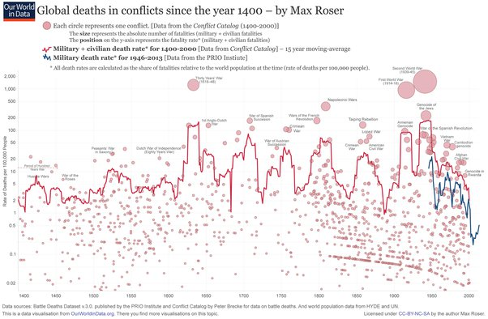

*Réponse publiée [sur Quora](https://fr.quora.com/Peut-on-dire-que-si-le-20e-si%C3%A8cle-a-%C3%A9t%C3%A9-aussi-meurtrier-des-millions-de-morts-dans-les-guerres-les-r%C3%A9pressions-etc-c-est-parce-qu-il-n-%C3%A9tait-pas-religieux-au-sens-spirituel-du-terme/answer/Dr-Goulu)*

Le 20ème siècle a été meurtrier parce que la population humaine était élevée

proportionnellement à la population, il n'a pas vraiment été plus violent que les siècles précédents

