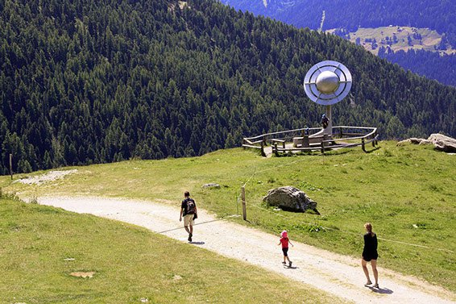

*Réponse publiée [sur Quora](https://fr.quora.com/Quelle-est-la-plus-grande-repr%C3%A9sentation-%C3%A0-l%C3%A9chelle-du-syst%C3%A8me-solaire/answer/Dr-Goulu)*

Je ne sais pas si c'est la plus grande, mais le [Sentier des planètes à St-Luc, Valais, Suisse](http://www.sentiers-decouverte.ch/nature-culture/sentier-planetes-randonature-193.html) vaut la visite.

il fait 6 km, le long desquels le Soleil et les planètes sont représentés à l'échelle de taille et de distance sous forme de sculptures.

Le Soleil n'est pas en volume car il serait trop gros mais il est représenté par une grande dalle tout près de l'[obser­va­toire Francois-Xavier Bagnoud](https://fr.tripadvisor.ch/Attraction_Review-g1130012-d6900933-Reviews-Obser_va_toire_Francois_Xavier_Bagnoud-Saint_Luc_Canton_of_Valais_Swiss_Alps.html),[https://fr.tripadvisor.ch/Attraction_Review-g1130012-d6900933-Reviews-Obser_va_toire_Francois_Xavier_Bagnoud-Saint_Luc_Canton_of_Valais_Swiss_Alps.html](https://fr.tripadvisor.ch/Attraction_Review-g1130012-d6900933-Reviews-Obser_va_toire_Francois_Xavier_Bagnoud-Saint_Luc_Canton_of_Valais_Swiss_Alps.html)qui permet d'observer le vrai grâce à un système de projecteur.

La dernière fois que j'ai parcouru ce chemin, j'ai marché (lentement) du Soleil à la Terre en 8 minutes, à la vitesse de la lumière à l'échelle…
