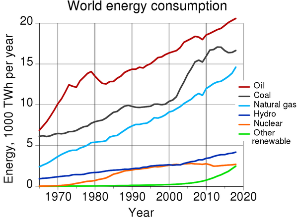

*Réponse publiée [sur Quora](https://fr.quora.com/Comment-les-%C3%A9nergies-renouvelables-%C3%A9voluent-elles-dans-le-monde-et-serait-il-possible-de-fonctionner-en-%C3%A9nergie-renouvelables-seulement/answer/Dr-Goulu)*

voici le graphique montrant l'évolution des [Ressources et consommation énergétiques mondiales](w:) :

Vous voyez :

1. que la principale énergie renouvelable dans le monde est l'hydroélectricité, qui représente encore environ le double des autres énergies renouvelables
2. que les autres renouvelables (éolien, solaire, biomasse et biocarburants) atteignent aujourd'hui le niveau du nucléaire
3. mais qu'il sont en croissance exponentielle rapide.

Il faut aussi relativiser le graphique ci-dessus, parce que si on empile les courbes les unes sur les autres pour obtenir les proportions d'énergie fossiles / renouvelables, on obtient environ 82% pour charbon+pétrole+gaz, 1% d'éolien et 0.5% de solaire.

Donc on est encore TRES loin de "fonctionner aux énergies renouvelables seulement".

Un des nombreux problèmes est que si l'énergie est renouvelable, elle est très diluée et que les endroits où il est rentable d'en produire ne sont pas renouvelables. On a construit les premières éoliennes aux endroits les plus ventés, les suivantes doivent se contenter d'endroits moins productifs. Les grandes toitures bien exposées en ville ont leurs panneaux solaires, bien plus rentables que ceux que les quelques m2 que certaines mettent sur leur toit au exposé nord pour se donner bonne conscience.

On entend souvent dire que l'objectif des accords de Paris revient à revenir aux émissions de CO2 de 1970 (je ne retrouve plus la source….) Si vous regardez le graphique ci-dessus, ça revient à baisser la consommation d'énergie fossile de 50 PWh ( petawattheures ) à 20, donc de produire proprement les 30 manquants, donc à multiplier par 10 la production d'énergie renouvelable.

Comme ça, ça parait atteignable d'ici 2050.

Mais ça c'est sans tenir compte de l'accroissement de la population, et des milliards de chinois, indiens, africains, américains du sud qui souhaitent légitimement améliorer leur niveau de vie, ce qui va nécessiter BEAUCOUP plus d'énergie.

Ce sont ces deux facteurs POP et PIB/POP de l'Equation de Kaya qui vont vous poser un réel problème, les jeunes…

[400 parties par million, et moi, et moi, émoi ? - Pourquoi Comment Combien](/2013/05/11/400-parties-par-million-et-moi-et-moi-emoi/#.X7o_580VOCo)
