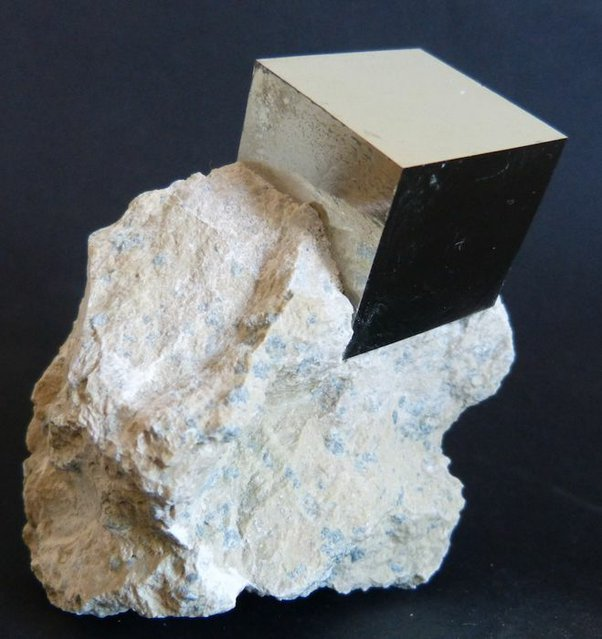

*Réponse publiée [sur Quora](https://fr.quora.com/Les-formes-g%C3%A9om%C3%A9triques-fictives-en-3-dimensions-tel-que-le-cube-ont-ils-pu-%C3%AAtre-inspir%C3%A9s-de-la-r%C3%A9alit%C3%A9/answer/Dr-Goulu)*

Cristal naturel de [Pyrite](w:)
