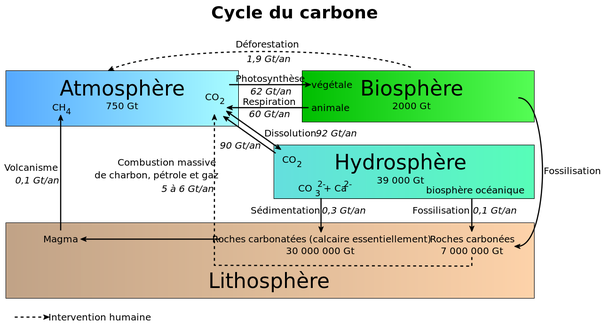

*Réponse publiée [sur Quora](https://fr.quora.com/Dans-quelle-proportion-le-CO2-%C3%A9mis-par-les-hommes-est-absorb%C3%A9-par-la-v%C3%A9g%C3%A9tation/answer/Dr-Goulu)*

Le [Cycle du carbone](w:) est assez complexe mais très grossièrement, les chiffres sont ceux-ci :

On voit que la Biosphère pourrait absorber environ 1/3 des émissions humaines de carbone, soit 2 Gt/an, si on ne déforestait pas environ autant (1.9 Gt/an), donc la végétation n'absorbe que 2% des émissions des combustibles fossiles.

Les océans absorbent aussi 2 Gt/an soit 1/3 des émissions, ce qui cause L'[Acidification des océans](w:).
