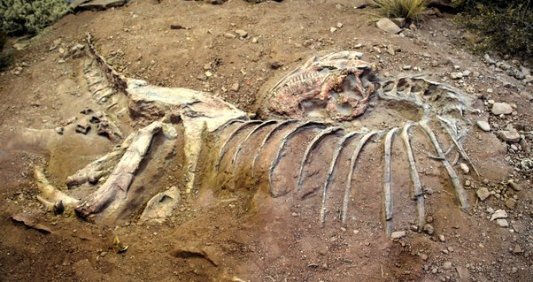

*Réponse publiée [sur Quora](https://fr.quora.com/Est-ce-que-des-gens-croient-que-les-dragons-ont-exist%C3%A9/answer/Dr-Goulu)*

Absolument, on en retrouve même des squelettes de temps en temps.

Franchement, qu'on les appelle "[Skorpiovenator](w:)" ou "dragon", quelle importance ?

Ces bêtes ont existé, nom d'un chien!
