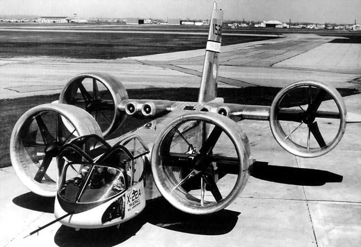
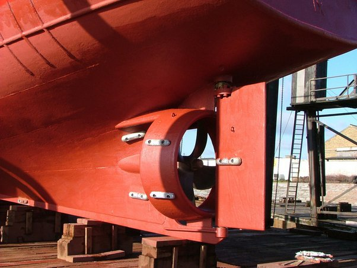
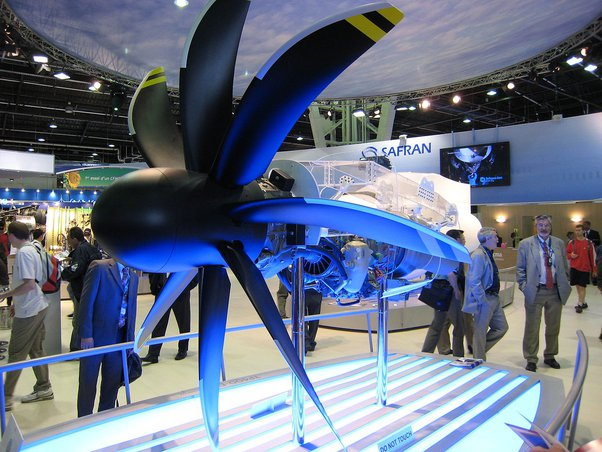
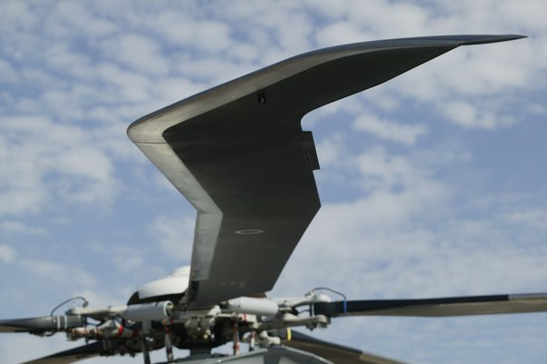

*Réponse publiée [sur Quora](https://fr.quora.com/Pourquoi-les-h%C3%A9lices-d-avion-ne-sont-pas-encastr%C3%A9es-dans-une-forme-tubulaire-pour-ainsi-augmenter-la-pouss%C3%A9e-vers-l-arri%C3%A8re-sans-perte-de-puissance-de-cot%C3%A9-vers-l-extr%C3%A9mit%C3%A9-des/answer/Dr-Goulu)*

Ca existe, mais c'est moche, lourd, et ça ajoute quand même de la traînée :

( [Bell X-22 — Wikipédia](w:Bell_X-22) )

Caché sous l'eau, pour certaines hélices de bateau, ça passe mieux:

[Tuyère Kort — Wikipédia](w:Tuyère_Kort)

Dans l'air, pour des raisons de poids, on préfère modifier la forme de la pale pour éviter le [Tourbillon marginal](w:), en particulier en lui donnant une forme [elliptique](w:Aile_elliptique)et/ou une torsion qui réduit la portance en bout de pale

Wow !

On pourrait aussi ajouter des winglets, ce qui se fait notamment sur certains hélicoptères.

Ou tout à la fois :

voir [Carénage d'hélice et hélice carénée](https://www.heliciel.com/logiciel-calcul-helice-aile/Carenage-helice-carene.htm)
