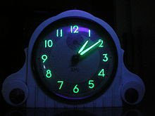

*Réponse publiée [sur Quora](https://fr.quora.com/Est-il-possible-de-voir-la-d%C3%A9sint%C3%A9gration-radioactive-en-action-transformer-une-substance-en-une-autre/answer/Dr-Goulu)*

Oui la nuit si vous avez une ancienne montre ou pendule dont le cadran a été peint avec du [Radium](w:) :

La [Radioluminescence](w:)est produite par la désintégration du radium en radon.
