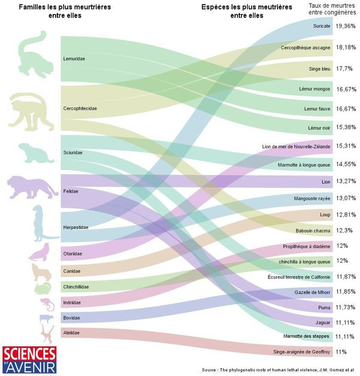

*Réponse publiée [sur Quora](https://fr.quora.com/Pourquoi-les-animaux-ne-sont-pas-agressifs-par-nature-alors-que-les-humains-peuvent-l-%C3%AAtre/answer/Dr-Goulu)*

Ne vous fiez pas à vos impressions.

[Le plus meurtrier des mammifères est… le suricate, loin devant l'Homme](https://www.sciencesetavenir.fr/archeo-paleo/evolution/le-plus-meurtrier-des-mammiferes-est-le-suricate-loin-devant-l-homme_105328)

Le taux de meurtre chez les humains (y compris guerres etc) est de 2% : 10 fois moins que les suricates, 5 fois moins que le singe-araignée de Geoffroy en bas du graphique.
