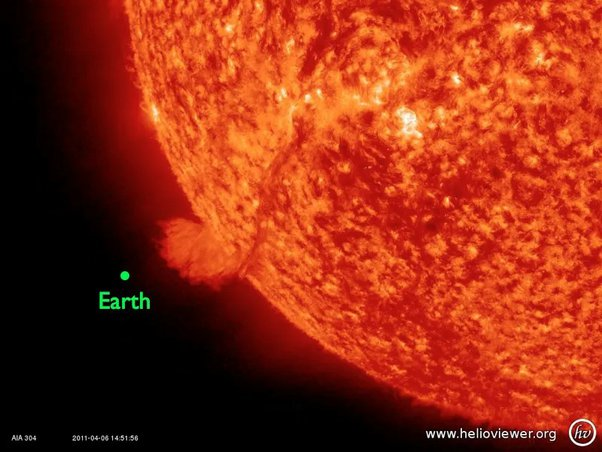

*Réponse publiée [sur Quora](https://fr.quora.com/La-Terre-influence-t-elle-le-soleil/answer/Dr-Goulu)*

Regardez ça :

(Source [How Big is the Sun? - The Sun Today with C. Alex Young, Ph.D.](https://www.thesuntoday.org/solar-facts/how-big-is-the-sun/))

ne trouvez vous pas un tantinet prétentieux d'imaginer que votre planète/poussière ait la moindre influence sur cette monstrueuse bombe thermonucléaire ?
