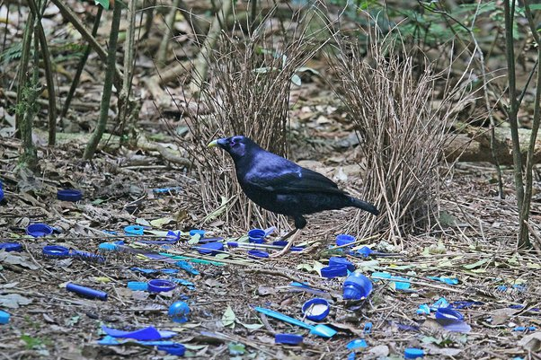

*Réponse publiée [sur Quora](https://fr.quora.com/Lesp%C3%A8ce-humaine-est-elle-la-seule-%C3%A0-porter-des-bijoux-ou-des-parures/answer/Dr-Goulu)*

Le [Jardinier satiné](w:) mâle décore son "berceau" de parade nuptiale avec des objets bleus :

Avant qu'Homo Sapiens lui fournisse gracieusement ces objets, ils les peignait lui-même :

> Ce phénomène extraordinaire a été découvert par Gannon (1930) qui avait remarqué que le mâle utilisait un morceau d’écorce pour déposer de la peinture (mélange de charbon de bois et de salive) sur les brindilles intérieures du berceau. Les études ultérieures de la part d’autres naturalistes et le visionnage de séquences vidéo récentes ont affiné l’observation de Gannon et ont permis de reconstituer le déroulement de ce comportement singulier car il représente l’un des rares exemples d’utilisation d’outils dans le monde des oiseaux. Le mâle commence par écraser dans son bec des baies bleu-noir et de la poussière de charbon de bois (provenant de feux de brousse) dilués dans sa salive. Puis il saisit un fragment d’écorce fibreuse et étale à l’aide de ce « pinceau » la mixture colorée à l’intérieur de l’allée. La peinture s’écoule du morceau d’écorce que l’oiseau tient en travers de son bec entrouvert et qu’il déplace de haut en bas sur les parois. Cet enduit noir bleuté sèche rapidement et forme une croûte grumeleuse de 2-3 mm d’épaisseur qui s’effrite assez facilement au doigt. Au pic des parades nuptiales, certains mâles repeignent chaque jour leur berceau avec un nouveau pinceau. Le sol de l’allée est alors jonché de particules de peinture séchée. Cependant, certains individus n’utilisent pas d’outils et déposent directement le colorant par le bec (Ottaviani 2014).
>
>
>
> (Wikipédia)
