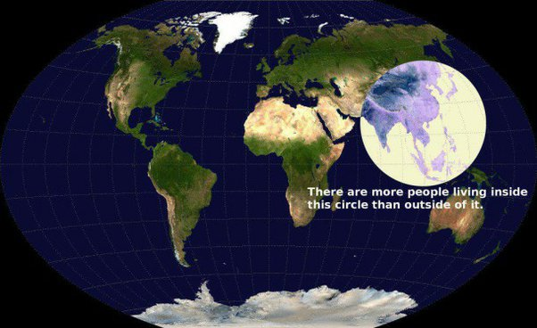

*Réponse publiée [sur Quora](https://fr.quora.com/Faut-il-cr%C3%A9er-un-gouvernement-mondial-comme-le-d%C3%A9crit-Jacques-Attali-afin-de-r%C3%A9guler-la-plan%C3%A8te-et-la-soci%C3%A9t%C3%A9-humaine/answer/Dr-Goulu)*

Je ne savais pas que Jacques Attali était un Bisounours. Fokon crée un gentil gouvernement mondial qui va résoudre tous les problèmes d'un coup de baguette magique. Wow. Mais pourquoi n y avait-on pas pensé plus tôt ?

Yaka élire Miss Monde Présidente : "je voudrais la paix dans le monde"…

Jacques , pour commencer taka faire renoncer la France puis les 4 autres membres permanents du conseil de sécurité de l'ONU à leur droit de veto.

Après, Yorapluka le transformer en organe démocratique. La majorité est là :

Ah mais j'y pense : au milieu du cercle ya le Pays de Candy où Xi bosse déjà sur le Grand Soir depuis un siècle. Et je vous parle pas des TéléTubbies de l autre côté, qui croient toujours être les "leaders du monde libre"… Ni du "peuple élu" ou du calife à la place du calife…

Je vais juste dire que dans tous les livres ou films où il y a un gouvernement mondial, ça ne se passe pas bien. Pas bien du tout.
