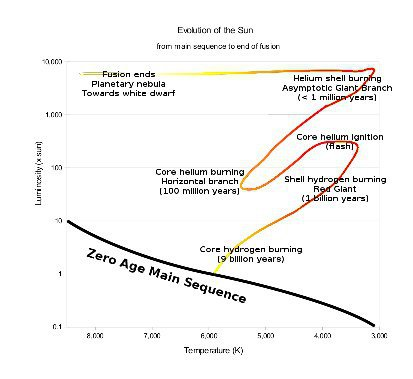

*Réponse publiée [sur Quora](https://fr.quora.com/Les-scientifiques-sont-ils-d-avis-que-le-soleil-pourrait-plus-tard-se-m%C3%A9tamorphoser-en-g%C3%A9ante-rouge/answer/Dr-Goulu)*

Oui, c'est même une certitude.

l'[Évolution stellaire](w:)est désormais bien connue, et on est même capables d'obtenir le [Diagramme de Hertzsprung-Russell](w:)expérimentalement :

[https://youtu.be/lhSFQXrVr48](https://youtu.be/lhSFQXrVr48)

Dans ce diagramme, le Soleil suivra cette évolution depuis sa position actuelle sur la séquence principale (en noir en bas)

