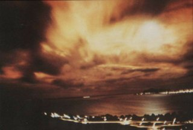

*Réponse publiée [sur Quora](https://fr.quora.com/Physique-nucl%C3%A9aire-qu-arriverait-il-si-on-lan%C3%A7ait-une-bombe-nucl%C3%A9aire-dans-l-espace/answer/Dr-Goulu)*

Ça :

Photo de l'éclair créé par l'explosion [Starfish Prime](w:) tel que vu depuis Honolulu à 1 445 km de là à travers une épaisse couche nuageuse.

(Source Wikipédia)
