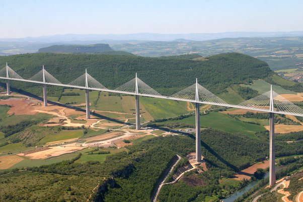

*Réponse publiée [sur Quora](https://fr.quora.com/Pourquoi-ne-construit-on-pas-des-ponts-au-dessus-des-oc%C3%A9ans-pour-relier-les-continents/answer/Dr-Goulu)*

Voici le [Viaduc de Millau](w:):

Le pilier le plus haut fait 343m. Dans l'océan, il devrait être au moins 10x plus haut.

Le pont fait 2460m de long. De Porto à New York, la distance est de 5300 km, 2000x plus long.

Par contre la portée entre 2 piliers (340m) devra rester la même, sinon ça tient pas. Donc il faut 14000 piliers environ.

Le Viaduc de Millau a coûté 340 millions d'euros. Le pont Porto New York coûterait 2000 fois plus pour la longueur, et au moins 10 fois plus pour la hauteur. Donc sans compter les difficultés spécifiques à la construction marine avec des technologies que nous n'avons pas encore, il y en a minimum pour 6800 milliards d'euro.

Le péage pour traverser Millau est de 8.60 euro. Pour Porto new York ce sera mathématiquement au moins 20'000 fois plus : 172'000 euro la traversée pour une voiture de tourisme 40'000 euro par personne pour vous traîner à 100 km/h pendant 50 heures, une semaine de conduite sans tenir compte de l'essence et des nuits dans des hôtels énormes tous les 1000 km environ.

Franchement, moi je préfère l'avion en first class.
