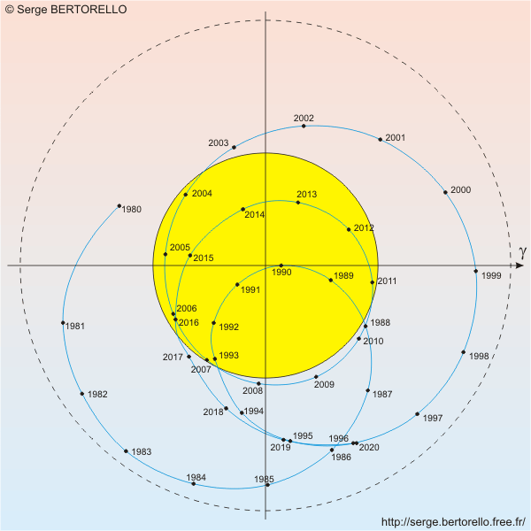

*Réponse publiée [sur Quora](https://fr.quora.com/Comment-sapelle-le-centre-de-gravitation-des-objets-c%C3%A9lestes/answer/Dr-Goulu)*

Ca s'appelle le [Centre de gravité](w:)des objets célestes considérés.

Celui de la Terre et de la Lune est [à 1710km sous la surface de la Terre](http://serge.bertorello.free.fr/astrophy/mouvements/mvmts11.html)

Celui du système solaire est assez nettement en dehors du Soleil ces temps-ci (oui, ça a à voir avec la conjonction Jupiter+Saturne )

(source : [Les mouvements de la Terre dans l'espace](http://serge.bertorello.free.fr/astrophy/mouvements/mvmts23.html) )

Celui de la Voie Lactée n'est pas loin du trou noir [Sagittarius A*](w:), mais probablement pas "dedans" car il est très léger par rapport à la masse totale de la galaxie.

Le centre de gravité n'est qu'un objet mathématique pratique pour les calculs. Il ne s'y passe rien de particulier, et il peut très bien être au milieu de nulle part …
