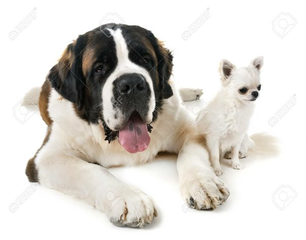

*Réponse publiée [sur Quora](https://fr.quora.com/Pourquoi-les-esp%C3%A8ces-animales-se-ressemblent-elles-toutes-mais-les-hommes-sont-ils-si-radicalement-diff%C3%A9rents/answer/Dr-Goulu)*

Heu… Vous voulez dire que ces deux là :

se ressemblent plus que vous et moi ???
