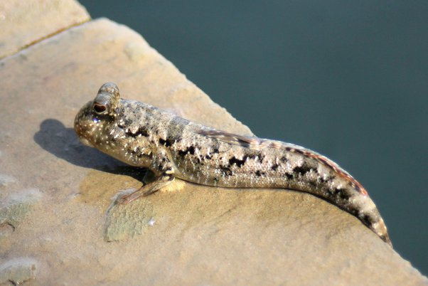

*Réponse publiée [sur Quora](https://fr.quora.com/Les-poissons-peuvent-ils-%C3%A9voluer-pour-vivre-sur-terre/answer/Dr-Goulu)*

Une vingtaine d'espèces de [Periophthalmes](w:Periophthalmus) sont en train d'essayer.

