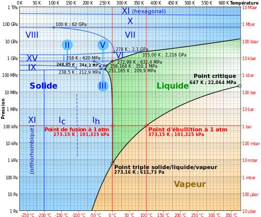

*Réponse publiée [sur Quora](https://fr.quora.com/Est-ce-que-la-pression-change-le-point-de-cong%C3%A9lation-de-l-eau/answer/Dr-Goulu)*

Peu aux pressions "normales". Le diagramme de phase de l'eau est celui-ci :

on voit que la température de solidification est à peu près constante depuis 611 Pa (moins de 0.01 atmosphère) jusqu'à 10 Mpa (100 atm) puis elle baisse très légèrement avec un minimum à 251.165 K (-22°C environ), puis augmente nettement dès 1GPa (10'000 atmosphères)
