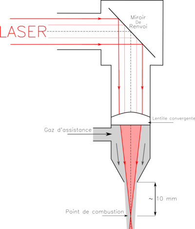

*Réponse publiée [sur Quora](https://fr.quora.com/Les-lasers-de-puissance-sont-ils-r%C3%A9fl%C3%A9chis-par-des-miroirs-et-en-quelles-proportions-Existe-t-il-des-miroirs-r%C3%A9fl%C3%A9chissant-100-des-rayons-laser-de-puissance/answer/Dr-Goulu)*

Oui, les lasers de puissance sont réfléchis par des miroirs lorsqu'ils sont défocalisés. Parce que contrairement à ce qu'on voit dans les films, les lasers de puissance sont produits avec des diamètres de plusieurs centimètres, sinon ils feraient déjà péter la fenêtre par laquelle ils sortent de leur cavité (pour les lasers à gaz genre CO2). On ne les focalise que tout près de la zone de travail

Même si les miroirs de renvoi ont une efficacité de 99.9%, il y a encore un millième de la puissance du laser qui s'y dissipe. Ils sont souvent refroidis par un élément peltier.
