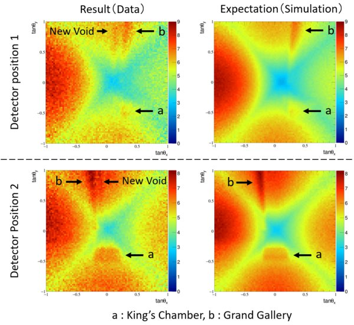

*Réponse publiée [sur Quora](https://fr.quora.com/Cela-fait-plus-de-deux-ans-que-l-on-a-d%C3%A9couvert-une-cavit%C3%A9-de-30m-au-dessus-de-la-grande-galerie-de-la-pyramide-de-Kh%C3%A9ops-Pourquoi-le-grand-public-ne-sait-toujours-pas-ce-qu-elle-renferme/answer/Dr-Goulu)*

Personne ne sait ce qu'elle renferme, si elle renferme quelque chose, pour la bonne et simple raison qu'on a pas encore été voir.

Déjà que les autorités égyptiennes ont trouvé que les japonais ont été un peu vite en besogne pour leurs publication de 2017 ( voir [Scanpyramids — Wikipédia](w:Scanpyramids) ), ils ne sont pas enthousiastes à l'idée de percer la pyramide au marteau-piqueur ou à la foreuse pour aller observer une anomalie détectée sur des images comme ça :

( source : [Physicists at Nagoya University discover a huge void in Giza's Great Pyramid by cosmic-ray imaging](https://web.archive.org/web/20200628035707/http://www.aip.nagoya-u.ac.jp/en/public/nu_research/highlights/detail/0004155.html) )

Cette pyramide et sa cavités sont là depuis 4500 ans, on peut avoir un peu de patience et faire les choses en douceur, non ?
