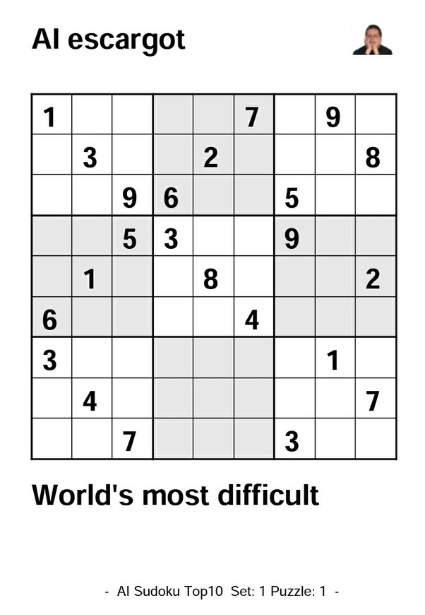

*Réponse publiée [sur Quora](https://fr.quora.com/Comment-est-d%C3%A9termin%C3%A9e-la-difficult%C3%A9-dun-sudoku/answer/Dr-Goulu)*

Commençons par définir quand un sudoku est très facile. C'est quand vous pouvez toujours déterminer avec certitude une cellule, parce que soit la ligne, soit la colonne, soit le carré contient les 8 autres chiffres.

La difficulté apparaît quand vous devez faire un choix, essayer, et revenir en arrière si vous êtes bloqué pour essayer une autre possibilité. Et évidemment, plus vous avez de choix à faire et plus ils surviennent tôt, plus c'est difficile.

Le Sudoku le plus difficile du monde est celui-ci :

(Source : [aisudoku](http://www.aisudoku.com/index_en.html) via [What are the criteria for determining the difficulty of Sudoku puzzle?](https://web.archive.org/web/20210308201534/https://puzzling.stackexchange.com/questions/29/what-are-the-criteria-for-determining-the-difficulty-of-sudoku-puzzle) Sur Stack Advisor)

Pour résoudre ce sudoku, vous devez faire des essais à chaque case. L'arbre à explorer est très grand, donc les algorithmes "force brute" comme celui-ci [[1]](#wgfXn) mettent plusieurs secondes (ce qui est très long) à le résoudre. Pour un humain, comptez plusieurs semaines…

Formellement, le sudoku est un [Problème SAT](w:), ou ou problème de [satisfaisabilité](w:) [booléenne](w:Booléen). Les programmes utilisant un "sat solver" comme celui-là [[2]](#sWhti), basé sur [pycosat](https://pypi.org/project/pycosat/) sont des centaines des fois plus rapides.

Notes de bas de page

[[1]](#cite-wgfXn)[Python : un petit Sudoku pour commencer - Pourquoi Comment Combien](/2008/10/12/python/)

[[2]](#cite-sWhti)[taufanardi/sudoku-sat-solver](https://github.com/taufanardi/sudoku-sat-solver)
