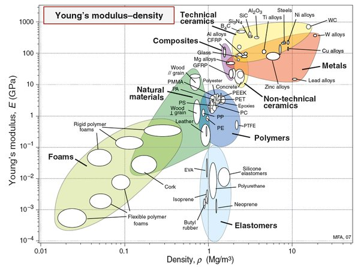

*Réponse publiée [sur Quora](https://fr.quora.com/Comment-identifier-les-mat%C3%A9riaux-en-fonction-de-leurs-propri%C3%A9t%C3%A9s/answer/Dr-Goulu)*

Je ne comprends pas vraiment la question, mais j'avais trouvé ce bouquin extraordinaire : [Stuart T. Smith](https://web.archive.org/web/20260202234132/http://openlibrary.org/authors/OL3200092A/Stuart_T._Smith), "[Foundations of Ultra-Precision Mechanism Design](https://web.archive.org/web/20200531/http://openlibrary.org/books/OL9768075M/Foundations_of_Ultra-Precision_Mechanism_Design_(Developments_in_Nanotechnology_Vol_2))" (1994) , notamment le chapitre huit, consacré à la [sélection des matériaux](http://www.wikipedia.org/search-redirect.php?language=en&go=Go&search=Material_selection).

On y montre que les caractéristiques habituelles des matériaux (densité, module d’élasticité, conduction thermique etc.) interviennent rarement seules lorsqu’on cherche un matériau adapté à la construction d’un système pointu. Beaucoup plus souvent on a besoin d’un compromis entre plusieurs de ces caractéristiques que l’on peut représenter dans un “diagramme d'[Ashby](w:en:Michael_F._Ashby)” comme celui ci-dessous:

Le livre va plus loin en normalisant les matériaux par rapport à un matériau de référence, ce qui permet de comparer facilement les matériaux entre eux.

[Trop-plein de Juin - Pourquoi Comment Combien](/2014/06/29/trop-plein-de-juin-2/)
