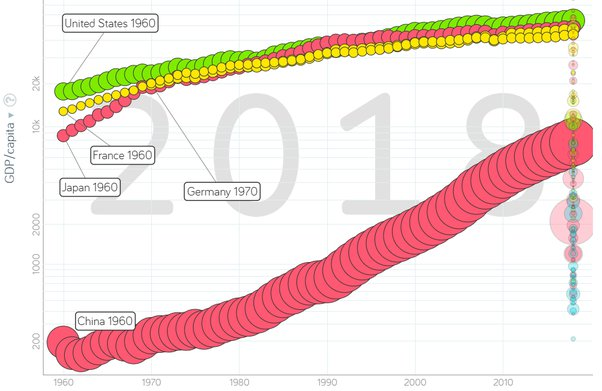
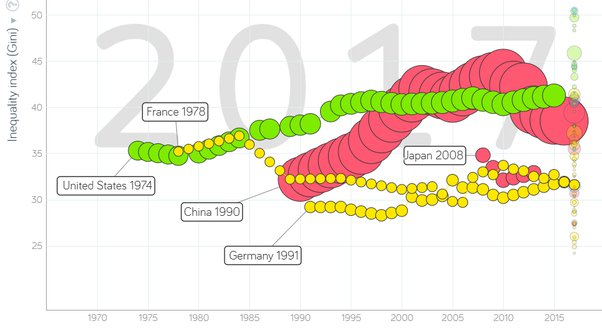

---

title: Comment le PIB américain a-t-il pu croître à un rythme aussi élevé par rapport à celui de tous les autres pays au cours du XXe siècle, et comment se fait-il qu'il reste aussi élevé malgré une dette nationale aussi énorme ?
slug: comment-le-pib-americain-a-t-il-pu-croitre-a-un-rythme-aussi-eleve-par-rapport-a-celui-de-tous-les-autres-pays-au-cours-du-xxe-siecle-et-comment-se-fait-il-qu-il-reste-aussi-eleve-malgre-une-dette-nationale-aussi-enorme
date: '2020-06-02'
draft: true
categories:
- Comment
tags: []
coverImage: ./images/qimg-ffdceebc862c710d0277b7b630b97d9b.jpg
---

*Réponse publiée [sur Quora](https://fr.quora.com/Comment-le-PIB-am%C3%A9ricain-a-t-il-pu-cro%C3%AEtre-%C3%A0-un-rythme-aussi-%C3%A9lev%C3%A9-par-rapport-%C3%A0-celui-de-tous-les-autres-pays-au-cours-du-XXe-si%C3%A8cle-et-comment-se-fait-il-qu-il-reste-aussi-%C3%A9lev%C3%A9/answer/Dr-Goulu)*

Parce que les USA c'est grand. Mais si on regarde le PIB / habitant, qui est celui qui compte pour chacun d'entre nous, il n'a rien de spécial, il a juste cru avant les autres économies mais l'Europe et le Japon l'ont rattrapé dans les années 1980–1990, et la Chine est en train de le faire :

source géniale : [Gapminder Tools](https://www.gapminder.org/tools/#$state$time$value=2018;&marker$select@$country=usa&trailStartTime=1960;&$country=chn&trailStartTime=1960;&$country=fra&trailStartTime=1960;&$country=deu&trailStartTime=1970;&$country=jpn&trailStartTime=1960;;&axis_x$which=time&domainMin:null&domainMax:null&zoomedMin=1917&zoomedMax=2033&scaleType=time&spaceRef:null;&axis_y$which=gdppercapita_us_inflation_adjusted&domainMin:null&domainMax:null&zoomedMin:-16.18&zoomedMax:64687840.41&scaleType=genericLog&spaceRef:null;;;&chart-type=bubbles), malheureusement sans chiffres d'avant 1960.

Vous allez peut-être me dire "oui mais les USA sont quand même plus hauts, surtout sur une échelle log …", alors je vais vous répondre avec ça:

C'est la mesure des inégalités de revenu. Et paf. Le PIB/habitant des USA est haut "grâce" aux riches, et la croissance économique s'est accompagnée d'un accroissement net des inégalités. Dans les autres pays dont la Chine (communiste…), et (sisi…) la France, les inégalités ont diminué, du moins pendant certaines périodes.
