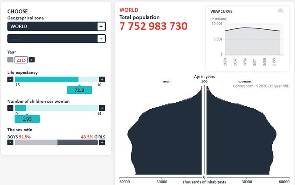

*Réponse publiée [sur Quora](https://fr.quora.com/Comment-r%C3%A9duire-le-nombre-d-habitants-sur-la-Terre-dans-100-prochaines-ann%C3%A9es-sans-meurtres/answer/Dr-Goulu)*

En limitant les naissances à moins de deux enfants par femme (actuellement c'est 2.44).

Vous pouvez voir le résultat en jouant avec le [Simulateur de population](https://web.archive.org/web/20200621222206/https://www.ined.fr/_modules/SimulateurPopulation/?lang=fr) de l'INED :

