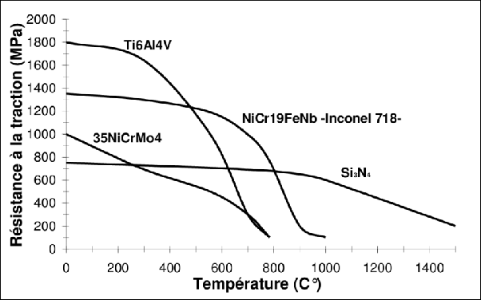
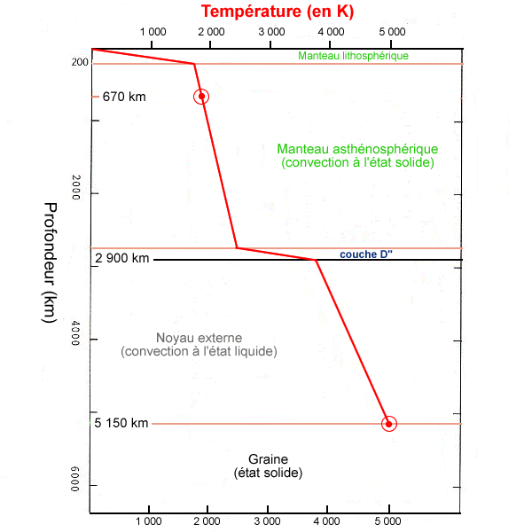

*Réponse publiée [sur Quora](https://fr.quora.com/Est-ce-que-le-fait-de-percer-le-manteau-terrestre-pour-atteindre-le-noyau-de-la-terre-pourrait-provoquer-des-remont%C3%A9es-de-magma-incontr%C3%B4lables/answer/Dr-Goulu)*

Je parie plutôt sur la transformation de votre [Trépan](w:) en magma bien avant ça.

Voici les courbes de résistances mécanique de certains matériaux

Et voici une estimation du profil de température en fonction de la profondeur :

(source [https://planet-terre.ens-lyon.fr...](https://web.archive.org/web/20190920143616/https://planet-terre.ens-lyon.fr/article/geotherme-profond.xml) )

Vous avez perdu. (le pari).
