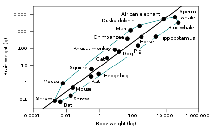

---

title: Existe-t-il une liste d'animaux déterminée du plus élevé au plus bas par la plus forte concentration de neurones dans le cortex cérébral (le nombre de neurones corticaux, celui qui détermine l'intelligence, la compréhension, la stratégie, etc. )?
slug: existe-t-il-une-liste-d-animaux-determinee-du-plus-eleve-au-plus-bas-par-la-plus-forte-concentration-de-neurones-dans-le-cortex-cerebral-le-nombre-de-neurones-corticaux-celui-qui-determine-l-intelligence-la-comprehension-la-strategie
date: '2020-05-11'
draft: false
categories:
- Quora
tags:
- evolution
- biologie
- animaux
- comparaisons
- zoologie
coverImage: ./images/qimg-973372f5b61b8aedaf330af7db901a09.png
---

*Réponse publiée [sur Quora](https://fr.quora.com/Existe-t-il-une-liste-danimaux-d%C3%A9termin%C3%A9e-du-plus-%C3%A9lev%C3%A9-au-plus-bas-par-la-plus-forte-concentration-de-neurones-dans-le-cortex-c%C3%A9r%C3%A9bral-le-nombre-de-neurones-corticaux-celui-qui/answer/Dr-Goulu)*

Oui, par exemple ici : [Liste d'animaux par le nombre de neurones — Wikipédia](w:Liste_d'animaux_par_le_nombre_de_neurones)

vous voyez que soit en nombre absolu de neurones, soit en se limitant au cortex il y a des animaux (éléphant et globicéphale respectivement) qui nous écrasent littéralement.

Alors on s'est dit "oui mais c'est normal, ils sont plus gros, et d'ailleurs la taille du cerveau suit à peu près celle du corps"

(source : [Neurosciences/Le cerveau dans le règne animal](https://fr.wikibooks.org/wiki/Neurosciences/Le_cerveau_dans_le_règne_animal) )

Pour ma part je ne vois pas vraiment pourquoi il faudrait plus de neurones pour commander un plus gros corps qui a le même nombre de membres et de muscles, à la rigueur un plus grand nombre de cellules sensorielles de la peau, mais bon… Le fait est que l'éléphant a toujours un ratio cerveau/poids équivalent au notre, et plus de neurones.

Alors on a inventé le [Coefficient d'encéphalisation](w:Encéphalisation) (EQ) qui mesure l'écart de la taille du cerveau par rapport à une loi de puissance soigneusement ajustée, et alleluia ! La supériorité du cerveau humain est enfin obtenue de manière irréfutable.

Honnêtement, je n'ai pas vu grand chose en sciences qui soit d'aussi mauvaise foi que ce coefficient d'encéphalisation . Déjà il est construit sur la base des mammifères, et quand on voit que l'EQ de la raie manta (0.40) est proche de celui du rat (0.46), mais que l'EQ de la pieuvre (0.055) vaut le dixième de ça, on se dit que le lien avec les capacités cognitives est loin d'être évident…
