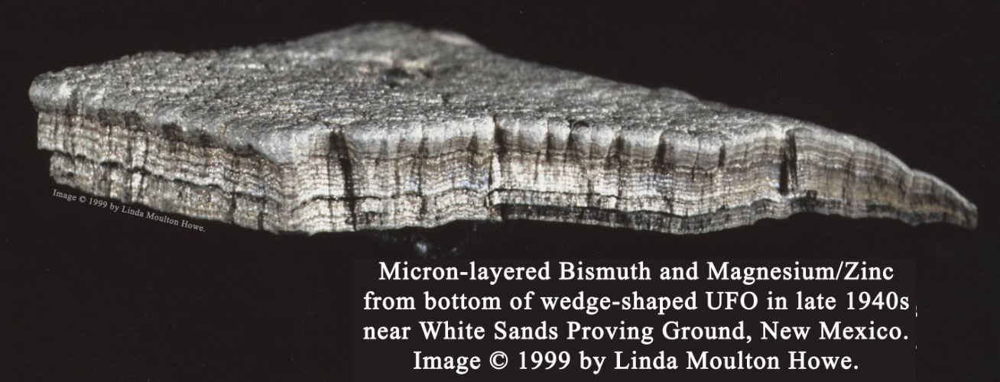



La semaine passée, l'émission "Temps Présent" de la RTS (notre "Envoyé Spécial à nous...) a diffusé le reportage [OVNIS, une affaire d'états](https://web.archive.org/web/20200718174317/https://www.rts.ch/play/tv/temps-present/video/ovnis-une-affaire-detat?id=11463697) [[1]](#ref-1) qui revient sur la publication récente de vidéos de l'US Air Force montrant des interceptions d'objets volants non identifiés par des F-18 américains.

Il y a plusieurs raisons pour lesquelles j'ai trouvé ce reportage mauvais, voire [fallacieux](https://fr.wiktionary.org/wiki/fallacieux) , mais la principale est le passage sur

## le "méta-matériau" bismuth-magnesium.

A 56:57 du reportage on voit un certain [Dr. Hal E. Puthoff](w:en:Harold_E._Puthoff) dire ceci lors d'une conférence [[2]](#ref-2):

> C'était un échantillon multicouche de bismuth et de magnésium. Les couches de  bismuth sont moins épaisses qu'un cheveu humain. Les couches de magnésium font environ dix fois la taille d'un cheveu humain. Soi-disant récupéré lors de la récupération d'un véhicule aérospatial avancé écrasé. On dirait qu’il s’agit d’un crash. Les lignes blanches sont du bismuth; les zones les plus sombres sont les séparations de magnésium. Donc, la question était de savoir ce qu'il en était de ce matériau, alors naturellement nous avons regardé dans tous les laboratoires nationaux, nous avons parlé aux métallurgistes, nous avons passé au peigne fin toute la structure des articles publiés. Nulle part nous n'avons pu trouver la moindre preuve que quiconque ait jamais fait ceci.
> 
> Ensuite, certaines tentatives ont été faites pour essayer de reproduire ce matériau, mais elles n’ont pas réussi à faire adhérer les couches de bismuth et de magnésium.
> 
> Troisièmement, lorsque nous avons parlé à des gens du domaine des matériaux qui devraient savoir, ils ont dit que nous ne savions pas pourquoi quelqu'un voudrait faire quelque chose comme ça. Il n’est pas évident qu’il ait une fonction quelconque.
> 
> Eh bien, des années plus tard, des décennies plus tard en fait, enfin notre propre science évolue. Nous entrons dans une zone appelée méta-matériaux, et il s'avère que cette combinaison de matériaux exactement à ces dimensions s'avère être un excellent guide d'ondes microscopique pour les fréquences térahertz de rayonnement électromagnétique à très haute fréquence.

L'objet dont il parle est celui-ci :

Remarquez mon honnêteté intellectuelle : j'ai laissé les deux mentions du copyright de [Linda Moulton Howe](w:en) , et même le lien vers son site si vous cliquez dessus.

En 1996, Linda Moulton Howe (LMH) avait confié cet objet pour analyse à [Nicholas A. Reiter](https://www.coasttocoastam.com/guest/reiter-nicholas-6668/) un autre passionné d'OVNIs et de phénomènes étranges. Mais il ne trouve aucune propriété particulière à l'échantillon. La conclusion de son rapport détaillé à LMH est claire [[3]](#ref-3):

> Au niveau le plus élémentaire, nous pouvons affirmer que la partie d'artefact fournie par LMH ne semble PAS être composée d'éléments ou de composés inconnus. Il n'est pas non plus composé d'alliages d'une pureté ou d'une composition dépassant le cadre de la science des matériaux actuelle . L'artefact ressemble fortement aux résidus stratifiés irréguliers souvent trouvés dans les revêtements par [dépôt physique par phase vapeur](w:) (PVD) \*.  
> ...  
> À mon avis, l'artefact représente probablement un curieux sous-produit industriel de l'industrie des films minces ou d'une usine de coulée de magnésium. Cependant, jusqu'à ce qu'une correspondance soit trouvée, je n'exclurai pas la possibilité d'une origine plus inhabituelle

puis il trouve la correspondance en 2001 et publie une mise à jour encore plus claire [[3]](#ref-3):

> La combinaison du bismuth et du magnésium nous a échappé pendant quatre ans. Mais un jour, nous avons trouvé une référence à un obscur  procédé industriel utilisé dans le raffinage du plomb. Le procédé , appelé [procédé de Betterton-Krohl](w:en:Betterton–Kroll_process), utilise du magnésium fondu flottant à la surface du plomb liquide. Le magnésium aspire ou extrait les impuretés de bismuth du plomb! 
> 
> Ce processus peu connu aurait-il pu être la véritable origine d'un résidu métallique d'apparence inhabituelle, qui a ensuite été promu comme une technologie extraterrestre? \*\*

Cependant, LMH trouve ses conclusions peu convaincantes (she really wants to believe...), les passe sous silence et vend l'objet en 2017 pour $35'000 à [Tom DeLonge](w:), le chanteur de Blink-182 et passionné d'OVNI pour le compte de sa société [To the Stars... Academy of Arts & Sciences Inc.](w:en:To_the_Stars_(company)) qu'il a fondé... avec notre ami le Dr. Hal E. Puthoff. [[4]](#ref-4), [[5]](#ref-5)

Ce qui n'empêche pas celui-ci de qualifier 2cm² du déchet industriel le plus cher de l'histoire de "méta-matériau" en 2018...

Si vous aimez les théories du complot, voici pour vous : plus personne ne sait où est cet truc. Il s'est volatilisé chez "To the Stars", impossible de le ré-expertiser dans un laboratoire indépendant. Et [Nicholas A. Reiter est mort d'un cancer à 51 ans](http://www.apmagazine.info/index.php?option=com_content&view=article&id=480) ... 

### Note\*

En écrivant l'article, je suis tombé sur une autre explication un peu plus technique du "méta-matériau" qui correspond plus à la première hypothèse de Reiter en 1996 [[3]](#ref-3). C'est dans un commentaire de Viktor Golubic sur [[5]](#ref-5)

> Après avoir vu des gros plans des couches et d'autres matériaux de la collection reçus par Linda Howe, je crois fermement que le matériau en couches est un dépôt d'accumulation de surpulvérisation sans substrat à partir de bismuth de haute pureté (disponible en routine comme cible de pulvérisation) et de cibles de magnésium / zinc de haute pureté ( généralement disponible en tant que cible de pulvérisation à 99/1%) à partir d'une chambre de pulvérisation à magnétron utilisant un plasma d'argon comme ion de pulvérisation.
> 
> Étant donné que le Zn pulvérise à un taux plus élevé que le magnésium, vous le verrez généralement se déposer à 97/3% à partir d'une source de 99/1%, ce qui est exactement ce que nous trouvons être sa composition.
> 
> Les cibles de la chambre ont généralement un diamètre de 2 pouces avec une finition à la machine. Dans la présentation en trois parties de Linda sur YouTube, nous voyons une cible de pulvérisation de 2 pouces dans la collection qu'elle a reçue, ce qui fournit une preuve supplémentaire de cette origine. Les couches complètes prendraient environ 125 à 150 heures pour se déposer. En règle générale, les chambres ne sont pas nettoyées, ce qui permet souvent cette accumulation accidentelle sur les surfaces rugueuses de la machine à l'intérieur de la même chambre, ce qui explique sa croissance ondulante en tant que déchet de laitier au fil du temps. Je rechercherais des surfaces d'oxydation subtiles dans les couches pour déterminer à quelle fréquence la chambre était éventuellement ouverte et exposée à l'air lors des changements de pièces de substrat. Le substrat ou la pièce à revêtir est inconnu, mais les recherches de brevets révèlent de nombreuses possibilités pour voir ces métaux en étroite association les uns avec les autres dans le cadre de processus plus complets.

### Note \*\*

[[6]](#ref-6) donne plus de détails sur l'hypothèse de 2001:

> Vraisemblablement, il s'agit du processus breveté en 1938 [[7]](#ref-7), produisant une fine croûte de magnésium et de bismuth en couches, qui est retirée du plomb. Lorsque le magnésium est réutilisé, de nouvelles couches se forment. (Le Fortean Times a approuvé cette solution en 2016.) N'oubliez pas que l'échantillon de Vallée a été spécifiquement identifié comme du laitier, c'est-à-dire des débris industriels. Howe a refusé de faire connaître les résultats de Reiter, préférant enchaîner le mystère des «extraterrestres». Bien sûr, nous aurions besoin d'un échantillon connu réalisé par le procédé industriel pour tester les versions «extraterrestres», mais la distribution du laitier dans les pays industrialisés sont en faveur de cette solution.

## Mais encore

Je voulais encore parler de la liste des recherches chez [Bigelow Aerospace](w:en) ,  dont on nous dit deux fois dans le reportage (à 24:40 à 43:00) qu'elles sont tellement avancées qu'elles méritent vraiment 22 millions de dollars de fonds secrets. Sérieusement ? 22 millions sur 10 ans pour étudier 38 sujets tellement avancés [[8]](#ref-8) ? Même pas un million par sujet ? Ca ne finance même pas un chercheur par sujet, sur 10 ans ...

Qu'est-ce qui vous paraît le plus probable :

- que Bigelow Aerospaces nous invente la propulsion hyperspatiale en 10 ans
- ou que ces recherches ne donnent rien, ce qui est excusable vu leur difficulté science-fictionnesque, et que M. Bigelow finance la campagne de son copain [Harry Reid](w:) , visiblement ennuyé de devoir justifier ce projet mis en lumière par le président  de l'association des scientifiques américains [[9]](#ref-9) ?

C'est là le problème principal de ce reportage : il ne donne aucune voix aux scientifiques. Pas la moindre allusion à un léger doute sur le "méta-matériau". Pourtant c'est pas dur à trouver. Ce reportage est fait par des gens qui croient aux OVNIs, donnant la parole à des gens qui croient aux OVNIs, financés par des gens qui croient aux OVNIs. 

Quand un politicien à l'air aussi grave que mystérieux assène que les OVNIs sont apparus immédiatement après les essais nucléaires parce que ceux-ci rayonnent dans tout le spectre électromagnétique, la réaction immédiate de tout journaliste honnête serait de demander "mais il a bien fallu de nombreuses années à ces signaux pour aller jusqu'aux étoiles, non ?".

Et quand on mentionne un crash d'OVNI : "donc les ET voyagent plus vite que la lumière, dans des dimensions parallèles et/ou par magnétohydrodynamique, et ils épatent nos pilotes de F18 par leur manoeuvres défiant la physique, mais ils s'écrasent quand même assez souvent, non ?"

Mais non. Aucun sens critique. Le reportage consiste à montrer que la science, c'est de la gnognotte, qu'on est trop nuls pour comprendre un méta-matériau et que les extraterrestres sont en train d'arriver. Ce n'est plus une théorie du complot puisque les américains ont diffusé 3 vidéos floues où on voit à peine ce qui se passe, mais ni vitesse, ni relevé radar ...

C'est là que ça devient effectivement une "affaire d'état" parce que ce reportage digne de YouTube est financé avec mon pognon de con-tribuable, en ce qui me concerne la redevance TV.

De la part d'une chaîne de TV qui produit (encore) des émissions de vulgarisation scientifique de bon niveau, c'est vraiment navrant.

### Références:

1. [Ovnis, une affaire d'états](https://web.archive.org/web/20200926045943/http://www.film-documentaire.fr/4DACTION/w_fiche_film/59873_1) de [Dominique Filhol](https://www.unifrance.org/annuaires/personne/363541/dominique-filhol), 2020, 77 minutes ([RTS](https://web.archive.org/web/20200718174317/https://www.rts.ch/play/tv/temps-present/video/ovnis-une-affaire-detat?id=11463697))
2. Hal Puthoff, "Address to the SSE/IRVA Conference", Las Vegas, 8 June 2018 ([transcription en anglais](https://paradigmresearchgroup.org/2018/06/12/dr-hal-puthoff-presentation-at-the-sse-irva-conference-las-vegas-nv-15-june-2018/))
3. [Report Compiled By Scientific Research Technologist Indicates Earthly Origin, Howe Says Material Is Still Anomaly](http://www.ufowatchdog.com/howeufodebris.htm) 
4. [Tom DeLonge's UFO Research Company Paid $35,000 for 'Exotic' Metals, 2019, sur Vice.com](https://www.vice.com/en_us/article/qvge45/tom-delonges-ufo-research-company-paid-dollar35000-for-exotic-metals-that-might-actually-just-be-bismuth) (spoiler alert : ne cliquez pas sur ce lien avant d'avoir terminé la lecture de mon article svp...)
    
5. [UFO Researcher Explains Why She Sold 'Exotic' Metal to Tom DeLonge, 2019, sur Vice.com](https://www.vice.com/en_us/article/8xwp9z/ufo-researcher-explains-why-she-sold-exotic-metal-to-tom-delonge)
    
6. [Jason Colavito, "a potential solution to the mystery of the alien metal promoted by ToTheStars", 2018](http://www.jasoncolavito.com/blog/a-potential-solution-to-the-mystery-of-the-alien-metal-promoted-by-to-the-stars)
7. [Jollivet Leon Eugene](https://patents.google.com/?inventor=Jollivet+Leon+Eugene), "Process for refining lead which contains bismuth", 1938, brevet [US2133327](https://patents.google.com/patent/US2133327A/en) 
8. [Advanced Aerospace Threat and Identification Program: a list of all DIA products produced](https://fas.org/irp/dia/aatip-list.pdf)
9. [Steven Aftergood](https://web.archive.org/web/20200817025213/https://fas.org/author/steven-aftergood/) "[More Light on Black Program to Track UFOs](https://fas.org/secrecy/2019/01/aatip-list/)", 17 janvier  2019, sur le site de la Federation of American Scientists
