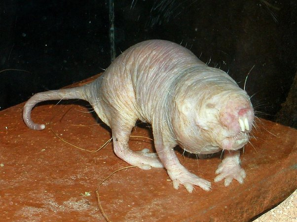
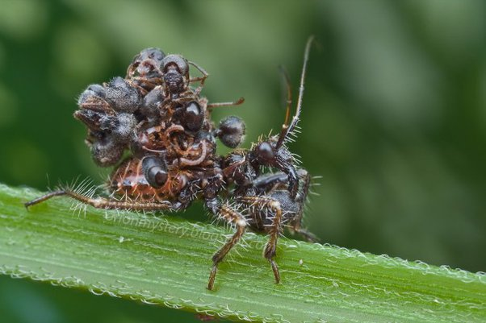
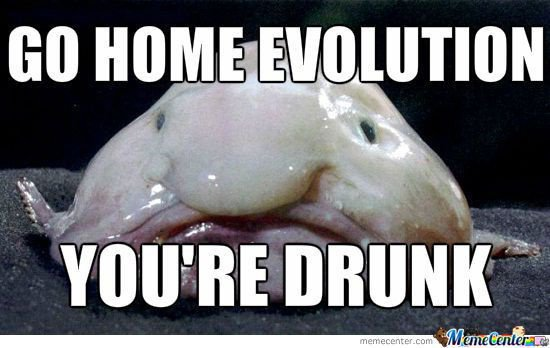

*Réponse publiée [sur Quora](https://fr.quora.com/La-th%C3%A9orie-de-l-%C3%A9volution-des-esp%C3%A8ces-peut-elle-%C3%AAtre-orient%C3%A9e-tr%C3%A8s-discr%C3%A8tement-par-une-hypoth%C3%A9tique-d%C3%A9it%C3%A9-Pour-info-je-ne-suis-ni-croyant-ni-incroyant-mais-neutre-et-curieux-Si/answer/Dr-Goulu)*

orientée vers ça :

([Rat-taupe nu — Wikipédia](w:Rat-taupe_nu))

vers ça :

( [Acanthaspis Petax, CC et Wikipédia - Pourquoi Comment Combien](/2013/01/26/acanthapis-petax-cc-et-wikipedia/)

ou vers ça :

([Blobfish — Wikipédia](w:Blobfish) source de l'image [[1]](#YpQnd) )

Je demande parce que :

1. toutes ces espèces sont aussi évoluées que nous. Preuve : elles existent, donc elles ont pu s'adapter aux changements de l'environnement tout comme nous
2. les mâles de ces espèces trouvent les femelles très attirantes, et vice-versa, sinon ils auraient disparu depuis longtemps. C'est dur à admettre, mais la beauté physique est relative à l'espèce [[2]](#hkcBO) (j'ose pas imaginer ce que les rats taupes nus pensent d'Adriana Karembeu…)

Pour revenir à votre question, on ne voit justement pas de direction dans laquelle la sélection naturelle pourrait être orientée. Pourtant on voit très bien dans quelle direction nous orientons la sélection artificielle pour produire des vaches laitières, des chevaux de course ou des moutons laineux.

Donc on voit très bien ce qu'on ferait à la place de l' "hypothétique déité", surtout celle qui nous aurait fait à son image…

Et hop j'ai trouvé une nouvelle preuve de l'inexistence de Dieu et que la sélelction naturelle n'est pas orientée : Adriana Karembeu n'a eu qu'un enfant, à 46 ans …

Le [Pastafarisme](w:) me semble beaucoup plus cohérent : le Monstre de Spaghetti Volant est complètement bourré. Là tout s'explique …

Notes de bas de page

[[1]](#cite-YpQnd)[Behold the Blobfish](https://web.archive.org/web/20201107234323/https://www.smithsonianmag.com/science-nature/behold-the-blobfish-180956967/)

[[2]](#cite-hkcBO)[Pourquoi on aime le joli, le sexy, le sucré et le drôle - Pourquoi Comment Combien](/2009/03/25/pourquoi-on-aime-le-joli-le-sexy-le-sucre-et-le-drole/)
