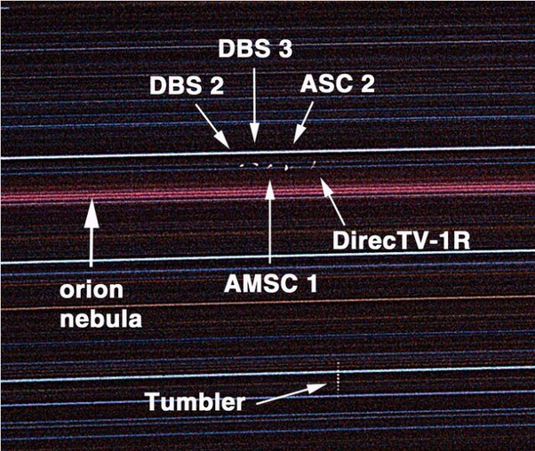

*Réponse publiée [sur Quora](https://fr.quora.com/Peut-on-observer-un-satellite-g%C3%A9ostationnaire-avec-un-t%C3%A9lescope/answer/Dr-Goulu)*

L'[Orbite géostationnaire](w:) est loin (36'000 km, un dixième de la distance à la Lune…) et les satellites sont petits … L'angle auquel on voit un objet de 10m à 36'000 km c'est 1.592E-5 degrés soit 57 millièmes de seconde d'arc.

C'est exactement le [Pouvoir de résolution du télescope Hubble](w:Pouvoir_de_résolution), mais il est dans l'espace. Sur Terre, il faudrait en principe un télescope de 2m de diamètre, ou le VLT…

Apparemment certains amateurs ont cependant réussi à en "observer" :

- [https://www.defense.gouv.fr/actu...](https://web.archive.org/web/20200922060756/https://www.defense.gouv.fr/actualites/economie-et-technologie/premiere-observation-d-un-satellite-geostationnaire-par-un-aviateur)
- [https://noirlab.edu/public/news/...](https://noirlab.edu/public/news/noao0106/) a même utilisé un "simple" appareil photo avec une très longue pose (5 à 6h) où on voit de petites taches blanches correspondant aux mouvements des satellites sur leurs orbites, qui n'est pas si précise que ça:

- Mais votre question m'a permis de trouver sur [Observing satellites](https://satelliteobservation.net/2017/04/20/observing-satellites/) cette magnifique video (merci!) d'un "timelapse" dans lequel on voit apparaître des petits points fixes le long d'une ligne dans le ciel, au début en haut à gauche puis vers le centre: oui, ce sont les géostationnaires !

[https://vimeo.com/39536582](https://vimeo.com/39536582)

[Geostationary satellites in the Swiss Alps from Michael Kunze on Vimeo](https://web.archive.org/web/20210227114734/https://player.vimeo.com/video/39536582)
