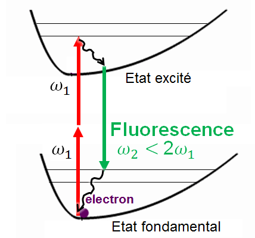
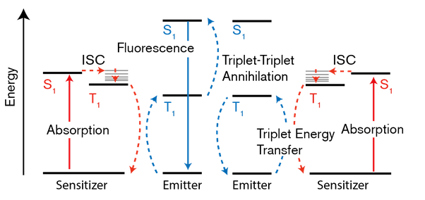

*Réponse publiée [sur Quora](https://fr.quora.com/Pourquoi-nexiste-t-il-pas-de-mat%C3%A9riau-fluorescent-qui-fonctionnerait-en-transformant-2-photons-infrarouges-en-un-photon-de-lumi%C3%A8re-visible/answer/Dr-Goulu)*

Le problème est que l'absorption d’un photon fait monter un électron d’un niveau d’excitation, et il émet un photon de la même énergie quand il redescend. Il ne peut en principe pas absorber deux photons et ne monter que d’un niveau, ni descendre de deux niveaux en n’émettant qu’un photon.

Sauf que si, et merci pour la question qui m’a permis d’apprendre ce qui suit. (donc il faut toujours demander “est-ce que” avant de demander “pourquoi” …)

[Maria Goeppert-Mayer](w:) a montré en 1931 que l’[Absorption à deux photons](w:) peut se produire, et ça a été vérifié expérimentalement en 1961, après l’invention des lasers.

Le problème est que la fluorescence est dans ce cas une [émission à deux photons](w:en:Two-photon_absorption), dont la somme des énergies est égale à la somme des énergies des photons excitateurs. Et le spectre d’énergie des photons émis est très large… (encore cette saleté de deuxième principe de la thermodynamique, je parie.)

Bref, si vous envoyez deux photons infrarouges à, disons 1000 nm de longueur d’onde, vous avez une faible probabilité d’en obtenir un dans le visible (entre 500 et 780 nm), mais l’autre sera désespérément infrarouge voire radio…

En cherchant si ça avait déjà été expérimenté, je n’ai rien trouvé, mais j’ai trouvé mieux : la “[Triplet fusion upconversion](w:en:Triplet-triplet_annihilation)” :

En 2019, une équipe de l’Université de Columbia a développé une substance qui convertit effectivement deux photons infrarouges en lumière visible grâce à ce phénomène auquel je n’ai provisoirement rien compris, mais qui se produit au niveau moléculaire, pas atomique :

L’application mentionnée est l’imagerie médicale.

Sources:

[Novel material converts infrared light into visible light (Update)](https://web.archive.org/web/20200702052840/https://phys.org/news/2019-01-scientists-visible-infrared.html)

[Photoredox catalysis using infrared light via triplet fusion upconversion](https://www.nature.com/articles/s41586-018-0835-2)
