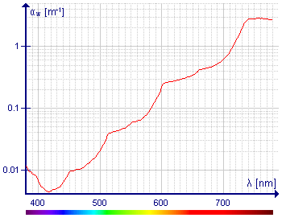

*Réponse publiée [sur Quora](https://fr.quora.com/Quelle-couleur-de-lumi%C3%A8re-p%C3%A9n%C3%A8tre-dans-l-eau-le-plus-profond%C3%A9ment/answer/Dr-Goulu)*

Merci pour la question, je n'avais jamais réalisé à quel point le spectre d'[Absorption du rayonnement électromagnétique par l'eau](w:)est l'inverse quasi parfait de celui d'émission par le Soleil :

en zoomant sur la zone du visible :

(ces petites bosses sont vraiment intrigantes …) le minimum est à 415 nm

Avec ma p'tite fonction [Goulib.colors.lambda2RGB](https://web.archive.org/web/20211205113910/https://goulib.readthedocs.io/en/latest/modules/Goulib.colors.html#Goulib.colors.lambda2RGB) et Jupyter ça donne ça:

qui ressemble vachement à la couleur dominante en plongée, je trouve …
