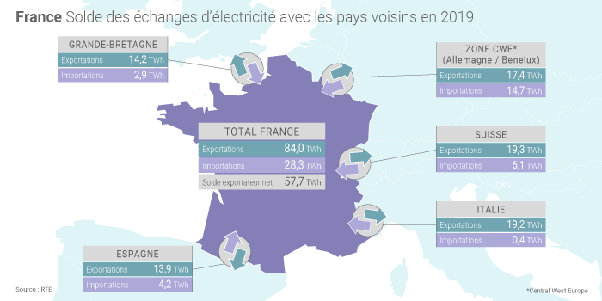

*Réponse publiée [sur Quora](https://fr.quora.com/Quelle-quantit%C3%A9-d-%C3%A9lectricit%C3%A9-EDF-exportent-ils-et-%C3%A0-quels-pays/answer/Dr-Goulu)*

vous pouvez le voir en temps réel sur [cette carte interactive](https://web.archive.org/web/20200801045636/https://www.electricitymap.org/zone/FR)

pour 2019 le [Bilan électrique de la France est là :](https://www.connaissancedesenergies.org/la-production-delectricite-en-france-metropolitaine-tous-les-chiffres-cles-de-2019-200212-0)

