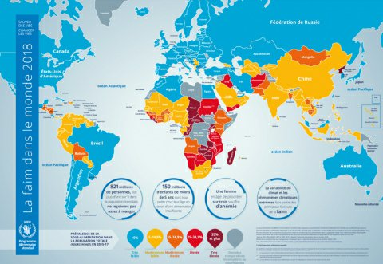
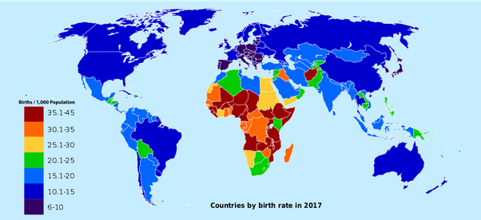

---

title: Selon le Programme alimentaire mondial (PAM), un enfant de moins de 5 ans meurt de faim toutes les 11 secondes dans le monde. Cela représente plus de 3 millions de décès d'enfants chaque année. Comment arrêter cette hécatombe ?
slug: selon-le-programme-alimentaire-mondial-pam-un-enfant-de-moins-de-5-ans-meurt-de-faim-toutes-les-11-secondes-dans-le-monde-cela-represente-plus-de-3-millions-de-deces-d-enfants-chaque-annee-comment-arreter-cette-hecatombe
date: '2020-10-19'
draft: true
categories:
- Comment
tags: []
coverImage: ./images/qimg-457a826ff0f60b25f63eb15d9f47218d.jpg
---

*Réponse publiée [sur Quora](https://fr.quora.com/Selon-le-Programme-alimentaire-mondial-PAM-un-enfant-de-moins-de-5-ans-meurt-de-faim-toutes-les-11-secondes-dans-le-monde-Cela-repr%C3%A9sente-plus-de-3-millions-de-d%C3%A9c%C3%A8s-d-enfants-chaque-ann/answer/Dr-Goulu)*

En favorisant la [Transition démographique](w:)par l'éducation des femmes

Carte de la faim / carte de la natalité

