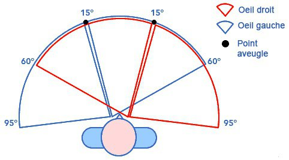
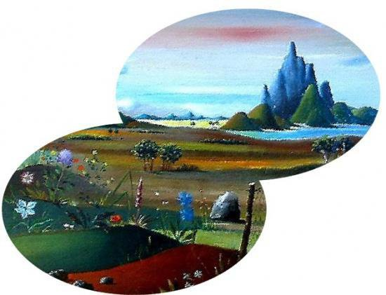

*Réponse publiée [sur Quora](https://fr.quora.com/Selon-vous-en-quoi-la-vision-humaine-serait-elle-diff%C3%A9rente-si-nous-avions-un-%C5%93il-derri%C3%A8re-la-t%C3%AAte-pour-voir-ce-qui-se-passe-dans-notre-dos-une-r%C3%A9ponse-en-image-%C3%A7a-serait-encore-mieux/answer/Dr-Goulu)*

Chaque œil a un angle de vision latéral d'environ 155°, avec un [Point aveugle](w:) d'environ 5° :

(source : [Les facultés sensorielles](http://www.astrosurf.com/luxorion/facultes-sensorielles.htm) sur astrosurf)

Avec le recouvrement des angles des deux yeux, on voit sur environ 190°, et il reste 170° cachés derrière-nous. Donc avec un "troisième oeil" dans notre dos, il resterait encore des "angles morts" de 15° de chaque côté. Il faudrait 4 yeux ou plus (comme les araignées…) pour reconstituer une image panoramique complète, sans trous.

Le cerveau arriverait probablement à compenser les défauts comme il le fait déjà pour les points aveugles et la superposition des zones binoculaires et monoculaires : on ne réalise pas que seules les 120° devant nous sont nets car nous ajustons nos yeux avec la distance.

Chez le caméléon, les deux yeux mobiles permettent probablement de produire des images cérébrales comme celle-ci, par [stitching](w:en:Image_stitching)

(source [L'œil du caméléon](https://web.archive.org/web/20180222195750/http://vue-homme-animal.doomby.com/pages/la-vue-des-animaux/l-il-du-cameleon.html#:~:text=Limite(s) de sa vision,lorsque il fixe une proie).)
