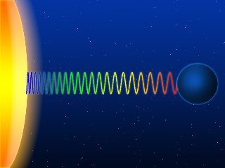

---

title: Si au point A, il y a une source de lumière, au point B un trou noir vers lequel dérive la lumière du point A et que je me trouve à quelques années-lumière de proximité au point C, comment vais-je percevoir le temps ?
slug: si-au-point-a-il-y-a-une-source-de-lumiere-au-point-b-un-trou-noir-vers-lequel-derive-la-lumiere-du-point-a-et-que-je-me-trouve-a-quelques-annees-lumiere-de-proximite-au-point-c-comment-vais-je-percevoir-le-temps
date: '2020-05-22'
draft: false
categories:
- Comment
tags:
- physique
- astronomie
- astrophysique
- relativite
- espace
coverImage: ./images/qimg-c1f5c162973cf4e0062cf886efe30522.jpg
---

*Réponse publiée [sur Quora](https://fr.quora.com/Si-au-point-A-il-y-a-une-source-de-lumi%C3%A8re-au-point-B-un-trou-noir-vers-lequel-d%C3%A9rive-la-lumi%C3%A8re-du-point-A-et-que-je-me-trouve-%C3%A0-quelques-ann%C3%A9es-lumi%C3%A8re-de-proximit%C3%A9-au-point-C/answer/Dr-Goulu)*

La lumière n'a aucune influence sur la perception du temps. Aux points A, B ou C, une horloge atomique indiquera une seconde par seconde. Ce qui manque à votre problème c'est une procédure de [Synchronisation des horloges](w:Synchronisation_d'Einstein) pour observer la durée des secondes d'un point depuis un autre.

Comme vos points sont distants les uns des autres, bougent probablement vite les uns par rapport aux autres, et que chacun est dans un champ gravitationnel plus ou moins fort, une chose est sûre : les horloges ne resteront pas synchronisées longtemps. Il est probable que le signal provenant du trou noir soit très lent par rapport à ceux de A (étoile ?) et C.

Sans horloges synchronisées, vous pouvez déjà mesurer le [Décalage d'Einstein](w:)de la lumière émise par A, et par le disque d'accrétion de B. Ça revient à ce qui précède : la lumière observée depuis C sera décalée vers le rouge à cause d'un écoulement du temps différent.

Cet effet est mesurable sur la lumière du Soleil, et même sur Terre. En 1960 L'[Expérience de Pound et Rebka](w:)l'a mesuré sur Terre sur une différence d'altitude d'une vingtaine de mètres. Aujourd'hui on peut la mesurer sur 30 cm : vos pieds vieillissent moins vite que votre tête.

