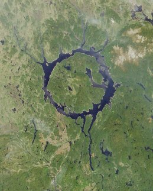

---

title: Si Dieu n'existe pas, comment les athées expliquent-ils le fait qu'il n'y a pas de cratères sur Terre alors que d'autres planètes en sont pleines ? Cela ne prouverait-il pas que Dieu protège la Terre ?
slug: si-dieu-n-existe-pas-comment-les-athees-expliquent-ils-le-fait-qu-il-n-y-a-pas-de-crateres-sur-terre-alors-que-d-autres-planetes-en-sont-pleines-cela-ne-prouverait-il-pas-que-dieu-protege-la-terre
date: '2020-03-31'
draft: true
categories:
- Comment
tags: []
coverImage: ./images/qimg-8f53331758d37f31a05f69ead9ffa33d.jpg
---

*Réponse publiée [sur Quora](https://fr.quora.com/Si-Dieu-n-existe-pas-comment-les-ath%C3%A9es-expliquent-ils-le-fait-qu-il-n-y-a-pas-de-crat%C3%A8res-sur-Terre-alors-que-d-autres-plan%C3%A8tes-en-sont-pleines-Cela-ne-prouverait-il-pas-que-Dieu/answer/Dr-Goulu)*

[de Manicouagan à Rochechouart - Pourquoi Comment Combien](/2009/04/16/de-manicouagan-a-rochechouart/)
