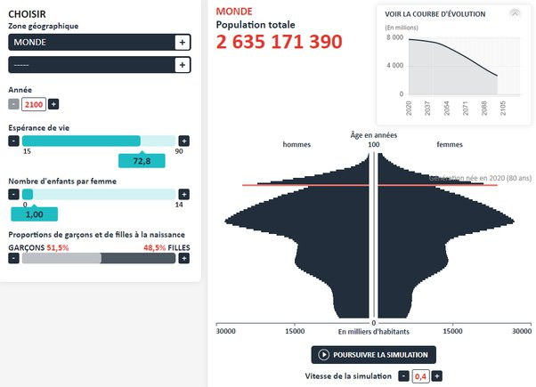

*Réponse publiée [sur Quora](https://fr.quora.com/Une-politique-de-lenfant-unique-peut-elle-sauver-le-climat-mondial-et-lhumanit%C3%A9/answer/Dr-Goulu)*

Essayez sur le [Simulateur de population](https://web.archive.org/web/20200417165559/https://www.ined.fr/_modules/SimulateurPopulation/?lang=fr) de l'INED. Ca donne ça:

Réduction de presque 8 milliards à 2.6 milliards en 2100, donc ça parait une bonne idée.

Mais si vous regardez les vagues que ça provoque dans la pyramide des âges, les problèmes sociaux, économiques et politiques que ça causerait me font encore plus peur (pour mes enfants et petits-enfants) que le réchauffement climatique.

Mais c'est peut-être parce que je n'ai aucune crainte pour l'humanité. On a vu pire sans aucun moyen d'agir, là on a plein de moyens d'agir.

Vous pouvez jouer avec un autre simulateur pour vous en convaincre : [En-ROADS](https://en-roads.climateinteractive.org/scenario.html?v=2.7.11) du MIT. Il incorpore aussi la croissance démographique
