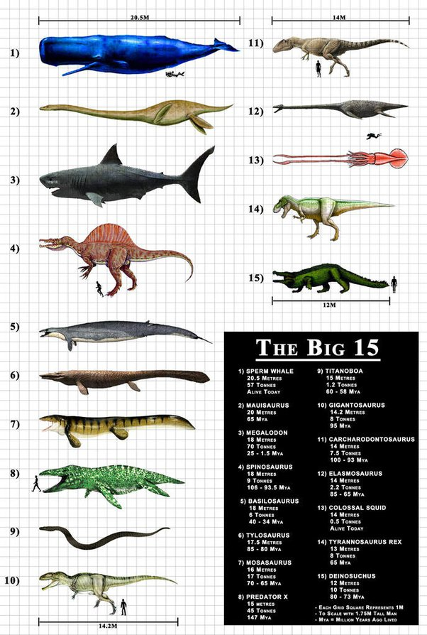

*Réponse publiée [sur Quora](https://fr.quora.com/Quel-est-le-plus-gros-et-meurtrier-pr%C3%A9dateur-ayant-jamais-exist%C3%A9-sur-Terre/answer/Dr-Goulu)*

le plus gros ou le plus meurtrier ? Ca n'est pas forcément le même …

Le [Mégalodon](w:)est souvent mentionné comme le plus gros prédateur ayant jamais existé, mais il n'était peut être pas plus gros que le [Grand cachalot](w:) actuel :

Pour le plus meurtrier, je n'ai plus aucun doute depuis avoir lu [Les manèges de la vie](https://www.goodreads.com/book/show/13389308-les-man-ges-de-la-vie) de Paul Colinvaux. C'est la coccinelle, ou un autre insecte similaire. Une seule coccinelle peut ravager une [colonie entière de 150 pucerons par jour](w:Coccinellidae) . Elle les transperce avec ses pièces buccales et aspire leurs organes les uns après les autres en ne leur laissant aucune chance de s'échapper.

Evidemment on se dit "oh la jolie petite bêbête" mais si vous ramenez l'échelle de l'illustration ci-dessus à l'échelle du puceron, vous vous retrouvez face à un immeuble de 10 étages qui court plus vite que vous.

Les 8 milliards d'êtres humains tuent 150 milliards d'animaux par an pour leur nourriture[[1]](#IBfhd) , ça fait moins de 200 par personne et par an. Une coccinelle en bouffe autant en un jour.

Notes de bas de page

[[1]](#cite-IBfhd)[Nombre d'animaux tués pour fournir de la viande dans le monde](https://www.planetoscope.com/elevage-viande/1172-nombre-d-animaux-tues-pour-fournir-de-la-viande-dans-le-monde.html)
