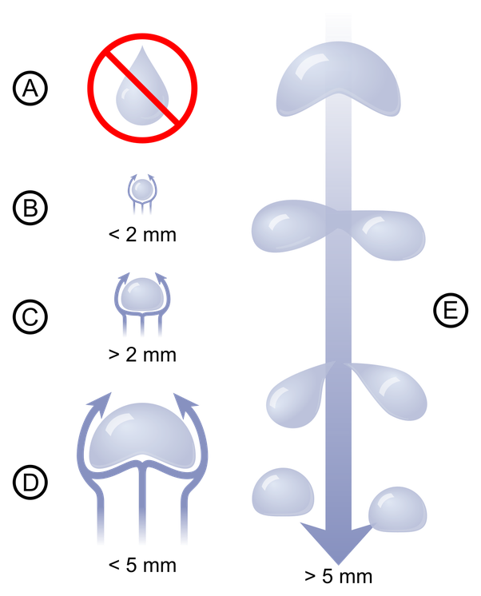
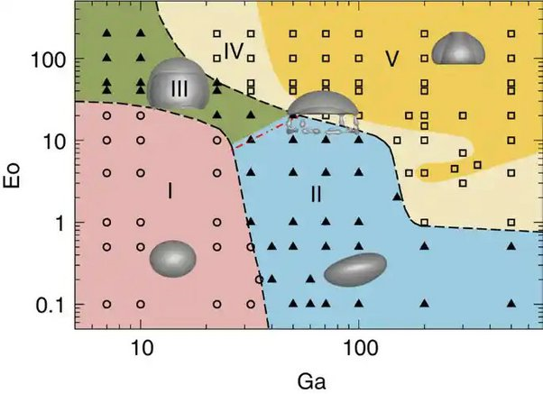
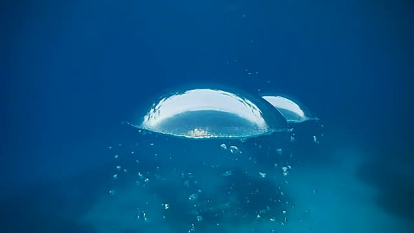

*Réponse publiée [sur Quora](https://fr.quora.com/Pourquoi-de-l-eau-tombant-dans-l-air-se-forme-en-goutte-alors-que-l-air-remontant-dans-l-eau-%C3%A0-une-forme-de-bulle-ronde/answer/Dr-Goulu)*

Ne vous fiez pas aux apparences

[Forme d'une goutte de pluie — Wikipédia](w:Forme_d'une_goutte_de_pluie) :

[Dynamics of an initially spherical bubble rising in quiescent liquid](https://www.nature.com/articles/ncomms7268)

Vous voyez le joli dome au milieu? En vrai c'est ça

Tous les plongeurs connaissent, c'est magnifique.
