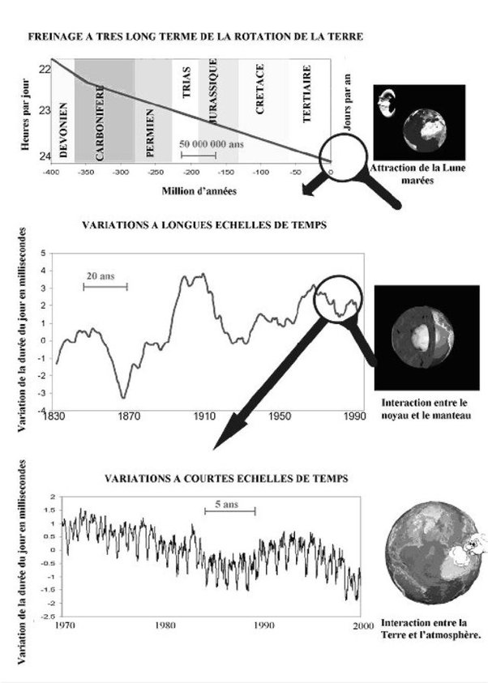

*Réponse publiée [sur Quora](https://fr.quora.com/Pourquoi-la-Terre-tourne-t-elle-plus-vite-depuis-cinq-ans/answer/Dr-Goulu)*

selon Christian Bizouard, astronome du Service national de la rotation de la Terre, à l’Observatoire de Paris interviewé dans [cet article d'Ouest France](https://www.ouest-france.fr/leditiondusoir/data/123049/reader/reader.html#!preferred/1/package/123049/pub/190142/page/5), 80 % des variations de la vitesse de la Terre sont liées au transport de masse dans l’atmosphère, autrement dit les vents, et le reste principalement aux marées.

D'après la figure ci-dessous trouvée dans [https://www.researchgate.net/pub...](https://www.researchgate.net/publication/252904305_La_mesure_de_la_Terre_est_une_des_bases_de_son_etude_physique)

On voit qu'une accélération ou un freinage sur 5 ans sont assez courants.
