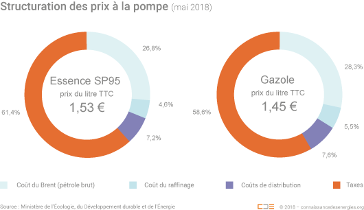
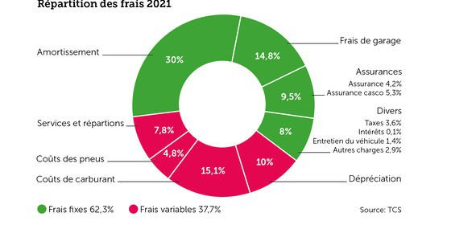

*Réponse publiée [sur Quora](https://fr.quora.com/Quel-est-le-prix-de-l%C3%A9lectricit%C3%A9-dune-voiture-%C3%A9lectrique-compar%C3%A9-%C3%A0-lessence-%C3%A9quivalente/answer/Dr-Goulu)*

Très bon marché parce que l'électricité n'est pas encore taxée.

En fait l'électricité est à peu près au même pris que l'essence si elle n'était pas taxée (~60 centimes par litre)

Donc pour l'instant le "plein électrique" revient à peu près au tiers du plein essence.

En plus les voitures électriques sont favorisées fiscalement etc, mais quand il y en aura beaucoup (en Suisse on estime vers 10%) il faudra trouver un moyen de les taxer pour qu'elles paient les infrastructures routières et les couts du trafic automobile comme les autres.

Et là on ne pourra pas "colorer les électrons" comme le fioul pour vendre à un prix différent le même produit suivant son usage.

L'idée qui fait son chemin est d'une "taxe au kilomètre" dépendant des émissions de CO2 du véhicule. "Au pif" je dirais qu'on va commencer par faire une taxe au km correspondant au prix de l'essence actuel, et qu'on va ajouter des taxes CO2 à l'essence en plus. C'est à peu près le chemin qu'on prend en Suisse du moins.

Cela dit, beaucoup de gens surestiment la part du carburant dans le coût de leur voiture. En Suisse, en moyenne le carburant ne représente que 15% du coût d'un véhicule :

(source : TCS [Frais kilométriques - Combien coùte ma voiture ?](https://www.tcs.ch/fr/tests-conseils/conseils/controle-entretien/frais-kilometriques.php) )

C'est un "coût variable", donc dépendant des km parcourus. Si vous parcourez plus que les 15'000 km annuels de moyenne, ce sera un peu plus, mais finalement les pleins d'un véhicule électrique actuel ne vous feront gagner que 10% du total, et les frais de service et réparation un peu aussi parce que les véhicule 100% électriques sont plus simples, mais l'amortissement sera plus élevé parce que le véhicule est tout de même encore plus cher que l'équivalent à essence.

Bref, j'envisage acheter une voiture électrique cette année, mais je ne suis pas encore vraiment décidé.
