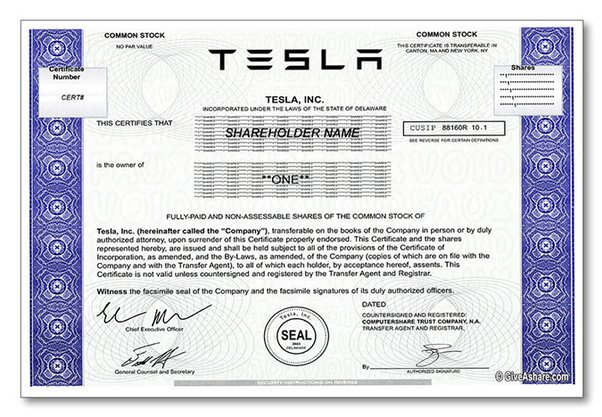

*Réponse publiée [sur Quora](https://fr.quora.com/Quelles-choses-Elon-Musk-peut-il-acheter-avec-sa-richesse/answer/Dr-Goulu)*

La fortune d'Elon Musk (188 milliards de dollars) correspond au[PIB nominal](w:Liste_des_pays_par_PIB_nominal)de l'Algérie ou du Qatar, un peu en dessous du Portugal pour rester en Europe.

Il peut donc théoriquement acheter tout ce qu'un de ces pays produit en une année.

Mais en pratique, il n'a pas cet argent sur son compte en banque. Il a une pile de papiers qui ressemblent à ça :

et que des gens sont près à lui acheter $850 pièce environ.

Le problème, c'est que s'il commence à les vendre, ce prix va baisser un peu, et que si on s'aperçoit que si les autres actionnaires s'aperçoivent que le fondateur d'une entreprise prometteuse vend ses actions, ils vont perdre confiance et vendre aussi leurs actions dont le cours va s'effondrer.

Elon Musk n'a aucun moyen d'empocher 188 milliards de dollars aujourd'hui. Il est condamné à faire croître son entreprise jusqu'à ce qu'une entreprise encore plus grosse lui achète tout son paquet d'actions d'un coup.

Et là il va pouvoir se payer un voyage sur Mars.
