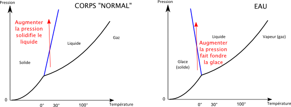

*Réponse publiée [sur Quora](https://fr.quora.com/Quelles-substances-autre-que-l-eau-occupe-un-volume-plus-grand-%C3%A0-l-%C3%A9tat-solide-qu-%C3%A0-l-%C3%A9tat-liquide-et-l-explication-de-ce-ph%C3%A9nom%C3%A8ne-est-il-dans-ces-cas-similaire-%C3%A0-celui-de-l-eau/answer/Dr-Goulu)*

Il y a [le gallium](https://scienceetonnante.com/2011/02/14/skier-sur-du-gallium/) et quelques autres qui se caractérisent par une pente négative de la transition de phase solide/liquide :

