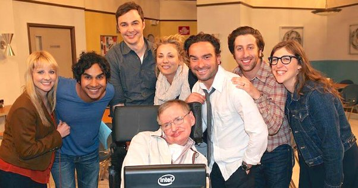

*Réponse publiée [sur Quora](https://fr.quora.com/Les-th%C3%A9ories-et-exp%C3%A9riences-d%C3%A9crites-dans-la-s%C3%A9rie-t%C3%A9l%C3%A9vis%C3%A9e-The-Big-Bang-Theory-sont-elles-v%C3%A9rifiables/answer/Dr-Goulu)*

Je ne sais pas à laquelle vous faites référence précisément, mais la série est très bien documentée scientifiquement. Il y a de nombreux sites qui analysent les tableaux noirs de Sheldon, et ils correspondent bien à ce qu'il dit ou à des théories de physique existantes.[[1]](#TPNjf)

Sinon Stephen Hawking n aurait pas participé à 7 épisodes. Bon dans l'un il relève une faute dans la théorie de Sheldon, donc il y a des fautes ;-)

Notes de bas de page

[[1]](#cite-TPNjf)[Do Sheldon's equations reflect real math/physics research?](https://movies.stackexchange.com/questions/1685/do-sheldons-equations-reflect-real-math-physics-research)
