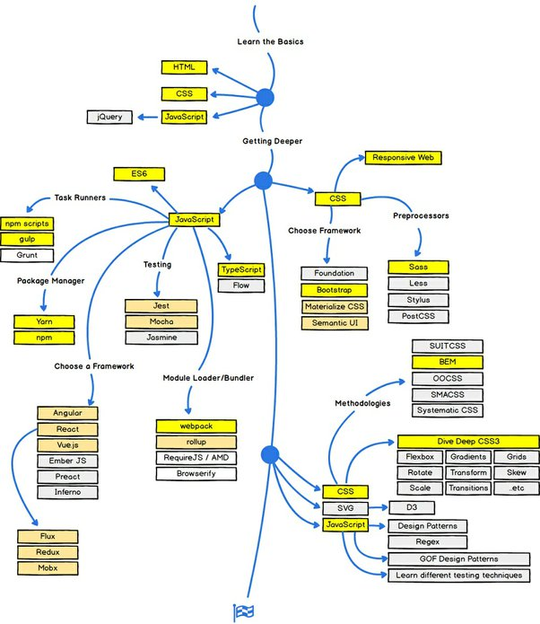
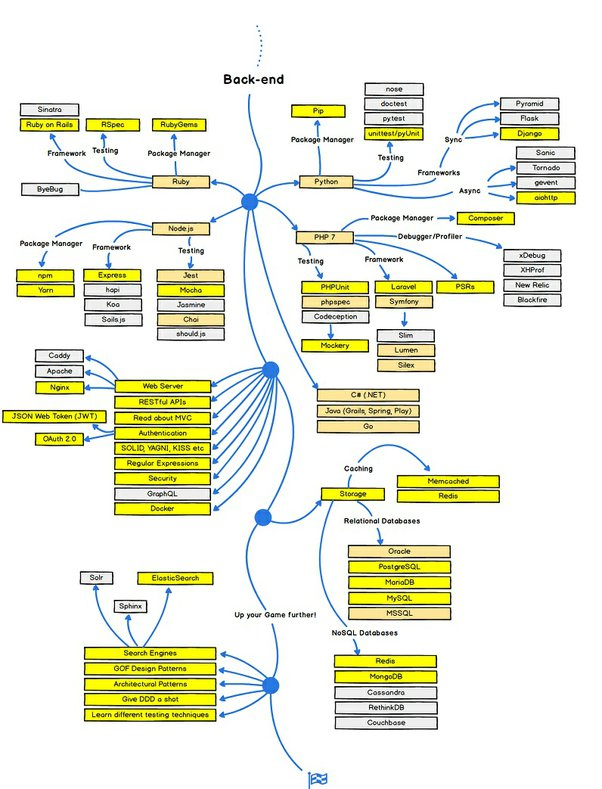

*Réponse publiée [sur Quora](https://fr.quora.com/Quels-langages-de-code-devrais-je-apprendre-pour-devenir-d%C3%A9veloppeuse-web-Et-dans-quel-ordre-Jai-d%C3%A9j%C3%A0-appris-HTML-et-CSS-maintenant-je-me-demande-quoi-faire/answer/Dr-Goulu)*

Là vous êtes au niveau novice du "front end".

Vous connaissez les langages, mais il vous reste probablement une multitude d'outils à connaître pour faire une app.

[La road map Du Web Development](https://www.w3schools.com/whatis/) est

Sinon, ou en parallèle, vous pouvez vous intéresser aussi au back-end, le côté serveur si vous préférez :

Puisque vous connaissez JavaScript, commencez par la branche node.js
