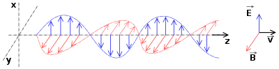

*Réponse publiée [sur Quora](https://fr.quora.com/Si-on-consid%C3%A8re-qu-il-existe-deux-types-de-champs-ontologiques-comme-celui-de-Higgs-ou-math%C3%A9matiques-comme-de-temp%C3%A9rature-de-quelle-nature-le-champ-%C3%A9lectromagn%C3%A9tique-est-il-Et-la/answer/Dr-Goulu)*

le [Champ de Higgs électrofaible](w:) n'a rien d'"ontologique" C'est un [Champ scalaire](w:) tout ce qu'il y a de plus "mathématique".

Et le champ de température n'existe pas, la [Température](w:) n'est que la perception macroscopique de la vitesse des particules. Mais c'est vrai qu'en ingénierie, c'est pratique de la représenter comme un champ. Scalaire aussi puisqu'à chaque point de l'espace 3D on peut associer la température en ce point, qui est un nombre "scalaire".

Puisque vous semblez bien aimer classer les choses dans des boîtes, le [Champ électromagnétique](w:) est un champ [Champ vectoriel](w:Champ_de_vecteurs), et même deux en fait. A chaque point de l'espace on peut associer deux "vecteurs", deux directions et intensités : celle du champ électrique et celle du champ magnétique.

Oui, la lumière et toutes les [Onde électromagnétique](w:) sont des perturbations couplées de ces champs :

