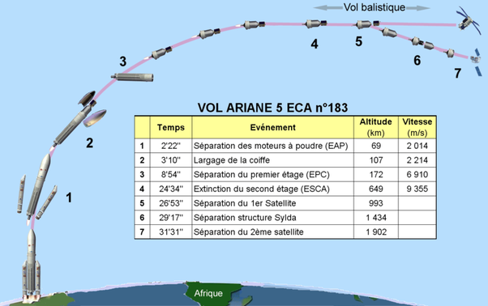
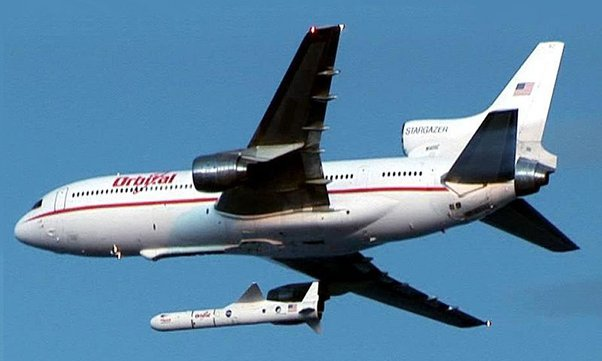

*Réponse publiée [sur Quora](https://fr.quora.com/Vu-quun-d%C3%A9collage-vertical-d%C3%A9pense-beaucoup-plus-d%C3%A9nergie-quun-d%C3%A9collage-horizontal-pourquoi-les-fus%C3%A9es-d%C3%A9collent-verticalement/answer/Dr-Goulu)*

Si vous regardez la trajectoire d'un lancement, vous voyez que le vol dans l’atmosphère ne prend que 2 mins environ sur les 30 avant lancement du satellite, pendant lesquels on atteint 5 à 10% de l'altitude et 25% de la vitesse :

Le gros du boulot se passe donc après la sortie de l'atmosphère, qu'on a intérêt à quitter le plus vite possible.

Utiliser la portance aérodynamique n'a que peu d'intérêt, mais on le fait pourtant avec les [Lanceur aéroporté](w:) pour de petites charges.

Lancement de fusée [Pegasus](w:Pegasus_(fusée)), qui peut mettre 450 kg en orbite basse. [LauncherOne](w:) de Virgin est similaire (500 kg en orbite basse)
