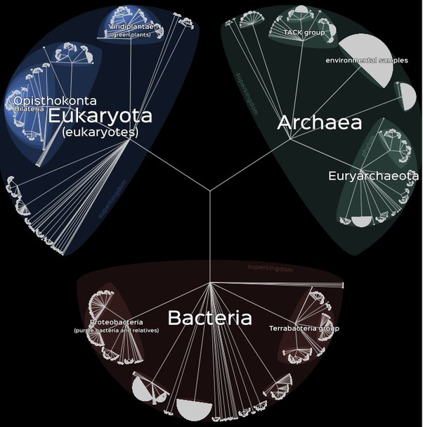

*Réponse publiée [sur Quora](https://fr.quora.com/Quelles-sont-les-esp%C3%A8ces-qui-ont-le-moins-%C3%A9volu%C3%A9-depuis-lapparition-de-la-vie/answer/Dr-Goulu)*

Toutes les espèces ont évolué pour s'adapter aux changements de climat, de leurs proies et de leurs prédateurs.

Donc toutes les espèces actuelles ont évolué exactement autant à partir de LUCA, notre [Dernier ancêtre commun universel](w:) à tous.

Pour vous en convaincre, vous pouvez aussi vous promener sur [Lifemap](http://lifemap.univ-lyon1.fr/explore.html) et remarquer que les ramifications des 3 grands "règnes" ou domaines sont assez semblables :

