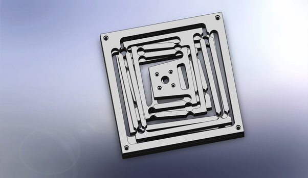

*Réponse publiée [sur Quora](https://fr.quora.com/De-combien-grandit-une-mati%C3%A8re-pi%C3%A9zo%C3%A9lectrique-en-%C3%A9tant-soumise-%C3%A0-un-courant-%C3%A9lectrique/answer/Dr-Goulu)*

Les cristaux de [PZT](w:) se dilatent d'environ 1/1000 sous l'effet d'une tension de 300V par mm d'épaisseur (au dessus le pzt se casse…)

Donc pour rester dans des tensions raisonnables, on fait des piles (stack) en empilant des pzt de 1mm don't chacune va se dilater de 1 micron.

Avec une pile de 100mm (10cm) vous allez obtenir 100 um, soit 0.1 mm de course.

Une stack pzt ne consomme quasi pas de courant pour se déformer. Le courant est consommé pour appliquer une force ou pression, qui peut être très élevée, typiquement 500N/mm2.

C'est pour ça que pour obtenir des déplacements plus importants, on combine souvent des pzt avec des structures déformables parallèles (utilisant des parallélogrammes) faisant effet de levier, souvent en titane.

Exemple au hasard ;-)

[Free CAD Designs, Files & 3D Models](https://grabcad.com/library/flexi-1)
